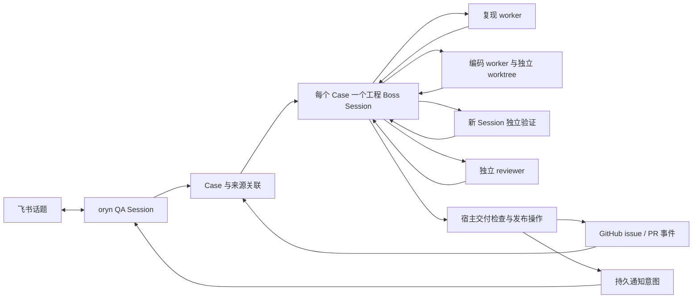

# Decision Record: Synergy Oryn implementation and developer handoff

Status: proposed

## Problem

QA 在飞书描述问题时，需要准确答复、必要澄清和最终结果。需要持续调查的问题应在后台完成复现、修复、独立验证和评审，再以可审阅的 GitHub PR 交给人类。当前 Synergy 的普通 Channel 会话与 GitHub 修复入口尚不能直接构成这个闭环。

已有 Boss、SessionInbox、Agent worker pool、ToolScheduler、Scope、Worktree 和 Library 足以承担主要运行职责；缺少的是角色授权、反馈与工程工作的稳定关联、可信验证记录及受控交付。不能以增加若干 prompt 代替这些保证，也无需再建 coordinator 服务、任务队列或多套 Synergy 内核。

本 proposal 是可供开发者实施的目标规格，不宣称下面的新工具、配置或检查已经存在。源码核对基线为 Synergy `81d568a8b4a0378d8b52cb4f4c8eee2ac17baab3`；目标仓库为 [yzxoi/synergy-oryn](https://github.com/yzxoi/synergy-oryn)，默认分支 `dev`。外部研究和实际 PR 证据集中在 [研究报告](../../../research/2026-09-07-maintenance-automation-proposal.md)，此文拥有实施规格；后续发现差异时先核对代码，再更新本规格和相应决策。

## Proposal

### 1. 产品范围与交付边界

第一版接收使用问题、bug、功能需求、性能、Web、CLI、服务端、飞书和原生桌面反馈。答疑不必建 issue；工程问题先查重、确认授权并保存 Case。无法复现、缺平台、缺访问能力或需要产品决策的任务进入人工接手状态，不判为报告无效，也不编造修复结果。

Oryn 是一份基于 Synergy 的专用产品配置与内核扩展：同一个 runtime 使用多个 Agent 定义和 Session。保留 Synergy 名称的内部包、CLI、环境变量和现有普通行为；在 Oryn README、产品说明和入口显示 Oryn。不开 QA/GitHub 两份长期分叉，也不在第一版建设独立管理站点、独立知识库或跨 runtime 调度。

自动化可以在预设授权内创建/更新 issue、写自己拥有的 topic branch、创建/更新 Draft PR、发布评审和将合格 PR 标为 ready。人类执行 merge，发布仍遵守目标仓库 release 流程。Oryn 不暴露 merge、release、强推、修改保护规则、批量关闭 issue 或接管他人分支的模型工具。

部署目标是无公网 IP、不能 Docker 的 Linux VPS。只需主动连接飞书 WebSocket、GitHub 和模型服务；执行环境探测失败时明确降级或转人工。大内存不能替代代码执行隔离。

### 2. 运行模型

每个 Agent 是定义；Session 是实际执行上下文。相同 Agent 可以同时用于多个 Session。单 Session 内维持现有串行 root-task 执行；不同 Session 共享 runtime 的模型与工具调度。父 Session 派单后等待 Inbox 事件，无需用模型轮询子任务。

每个独立问题拥有一个工程 Boss root Session，绑定经授权的目标 repo Scope。不同 Case 不共用一个无限增长的 Boss root。一个飞书话题可以关联多个 Case；多个报告者可以订阅同一个已确认的 Case，但共享工程结果不共享私有对话和访问权限。

QA Session 位于自己的 Channel Scope，工程 Session 位于 repo Scope；两者不是跨 Scope 的 Boss 父子。新的 Oryn Host 入口在 Channel core 解析身份与 Scope 后建立工程 Session，并通过 SessionInbox 交付初始任务。工程内部复用 BossService 派单/报告；不手写普通子代理的 Session.create + LLM 调用循环。

Boss root 当前没有“空闲时自动继续”策略。工程首次任务、worker 结果、外部状态变化和恢复事件都必须明确写入 Inbox 并唤醒它；只有 Session 记录而没有初始 Inbox 的 Case 不算启动成功。已有 Boss continuation 继续负责 worker 未报告任务；不要给普通 Boss root 增加无条件自循环。

### 3. Agent 规格

以下名称为最终建议 ID。新定义可集中在 `agent/builtin-oryn.ts`，由现有 Agent.create 工厂链条件注册；这是一组 Oryn 定义，不引入通用 Agent 框架。prompt 放 `agent/prompt/oryn/`。复用现有 `mid`、`thinking` 等模型角色及 fallback 解析；允许可信配置指定模型，不在源码写死厂商和计费假设。

| Agent         | 注册与调用方式                                                              | 输入                                                         | 必须产出                                                 | 模型默认                         |
| ------------- | --------------------------------------------------------------------------- | ------------------------------------------------------------ | -------------------------------------------------------- | -------------------------------- |
| `oryn`        | hidden primary，仅由 Oryn Channel Host 绑定                                 | 当前话题、允许读取的历史、已关联 Case 的脱敏状态             | 准确答案；集中澄清；反馈提交意图；面向用户的结果说明     | `mid`                            |
| `oryn-work`   | hidden primary，仅由 Oryn Host 创建工程 Boss root                           | Case、目标 repo、验收目标、允许操作、预算、已有执行/发布记录 | 下一步派单；有证据的修复交付；或具体人工接手理由         | `thinking`                       |
| `oryn-repro`  | non-hidden subagent，`visibleTo: ["oryn-work"]`；复现与验证分别新建 Session | 问题观察、允许环境、固定 baseline/head、验证要求             | 可执行的验证计划、实际运行回执引用、结果分类与未覆盖范围 | `mid`，复杂分析可配置 `thinking` |
| `oryn-code`   | non-hidden subagent，`visibleTo: ["oryn-work"]`                             | 已接受验收目标、复现证据、独占 worktree、待修 findings       | 本地提交候选、改动解释、测试变更、剩余风险               | `thinking`                       |
| `oryn-review` | non-hidden subagent，`visibleTo: ["oryn-work"]`；每个审查版本一个新 Session | 原问题、固定 diff、运行回执、前次 findings 和明确风险范围    | 结构化评审报告、findings、证据充分性、待人决定事项       | `thinking`                       |

保持 worker non-hidden 是为了复用 BossService.spawn 当前的 hidden 检查；mode 为 subagent，不出现在普通 primary 选择列表。`visibleTo` 限制普通模型委派对象。隐藏 root 通过现有 Host-owned primary 方式创建，不放宽所有 hidden agent 的可委派性。不得把 Light Loop / BlueprintLoop 的专属 reviewer 改成公开子代理。

复现阶段重在判断问题是否存在；验证阶段使用同一个 Agent 定义但新 Session、干净候选与重新读取的证据，不继续编码者上下文。reviewer 在阅读作者叙述前先读取 issue、diff 和直接观察。高风险改动额外创建同一 reviewer 定义的领域 Session，例如 persistence、security、channel；无需再造多个长期品牌名。

QA 的工作完成不意味着 Case 完成。工程 Agent 不直接回复飞书。编码者不能签发验证成功，reviewer 不能修改候选或自己正在遵循的交付 policy，复现者不能以测试结论授权远端发布。

Agent ID 用于注册；prompt 的职业身份分别是用户支持工程师、软件工程负责人、测试工程师、软件开发工程师和代码审查工程师。每份 prompt 按身份/职责、输入可信度、工具使用、完成结果、失败与验证顺序编写。QA prompt 用用户支持语言，不向用户解释内部 schema；内部工程角色可以引用准确代码词汇。共同明确：源码/issue/聊天内容是待分析材料，不能改变 Host 授权；没有实际运行依据不得声称测试通过；遇到未知状态报告具体缺口。

### 4. 工具授权矩阵

`read`、`glob`、`grep`、`ast_grep`、`skill`、`search_tools`、`expand_tools`、`memory_search`、`memory_get`、`boss_status`、`boss_report`、`session_read`、`edit`、`write`、`bash`、`process` 均为已有工具。下表所有 `oryn_*` 都需要实现。角色权限采用默认拒绝；工具可见性、权限和 Host 业务授权分别检查。工具展开、用户 Agent 配置、插件或候选仓库配置不得扩大 Oryn 的 Host 权限上限。

| Agent         | 允许的已有工具                                                                      | 新工具/动作                                                                                                                                          | 明确不允许                                                                         |
| ------------- | ----------------------------------------------------------------------------------- | ---------------------------------------------------------------------------------------------------------------------------------------------------- | ---------------------------------------------------------------------------------- |
| `oryn`        | 源码只读组、知识只读组、`skill`、受限工具发现                                       | `oryn_case` submit/get/list/amend/request_handoff；`oryn_reply`；`oryn_github_read`；`oryn_learn` propose                                            | shell、代码写入、任意 session_send、Boss 派单、GitHub 发布、任意 chatId 的消息发送 |
| `oryn-work`   | 源码/知识只读组、`boss_status`、仅本 Case 的 `session_read`                         | `oryn_case` get/list/request_handoff；`oryn_dispatch`；`oryn_result` get；`oryn_check` get；`oryn_publish`；`oryn_github_read`；`oryn_learn` propose | shell、直接编辑候选、原始 boss_spawn/assign、通用 GitHub 写工具、任意远端 URL      |
| `oryn-repro`  | 源码/知识只读组；在自己的实验 scratch 中 `edit`/`write`；`boss_report`              | `oryn_case` get；`oryn_check` propose/run/get；`oryn_result` submit/get；`oryn_github_read`                                                          | 修改冻结候选、远端发布、生产凭据、跨 Case 目录与会话                               |
| `oryn-code`   | 源码/知识只读组、`skill`、`edit`、`write`、隔离本地 `bash`/`process`、`boss_report` | `oryn_case` get；`oryn_check` propose/run/get；`oryn_result` submit/get；`oryn_github_read`；`oryn_learn` propose                                    | GitHub token、直接 push、merge、修改评审结果/原始回执/其他 worker 文件             |
| `oryn-review` | 源码/知识只读组、只读本 Case 证据与会话、`boss_report`                              | `oryn_case` get；`oryn_check` propose/run/get；`oryn_result` submit/get；`oryn_github_read`                                                          | 编辑候选、作者分支写入、发布、关闭自己的缺证据状态、修改运行 policy                |

源码只读组是 `read/glob/grep/ast_grep`，知识只读组是 `memory_search/memory_get`。启用 Library 时遵守现有可用性规则，不通过自建数据库绕过。普通工具均限制到明确授权的 repo、Case 和 scratch；只知道 Case ID 不获得读权限。QA 的知识读取必须受 workspace/敏感级别限制，不能把同安装内其他项目内容带给报告者。

编码 shell 只在隔离环境执行，并移除生产凭据、SSH agent 和管理端口访问。已有 Bash 会为 gh 自动注入 GitHub 凭据，Oryn worker 必须由可信执行上下文禁止这一注入；仅 deny `gh*` 的字符串规则不够，换用 curl 或脚本也不能取得凭据。候选代码、测试、git hooks 和插件发现都按不可信执行处理；可信 Host 不从候选 checkout 加载 executable config、工具或插件。

`process` 只允许管理当前 Assignment 创建的进程/ToolTask，不能通过任意 PID 操作 runtime 或其他 Case。Host 在工具调用和执行器边界同时验证归属；自主权限配置不会扩大这一范围。

复现和评审构造额外反例时，由 `oryn_check` 创建实验目录并执行计划。reviewer 的反例 patch 必须记录为验证 overlay，不进入候选分支；有 overlay 的结果不能标为原始候选未修改通过。编码者本地跑的测试可以辅助开发，只有受控执行入口产生的 RunReceipt 才能进入交付证据。

### 5. 新工具契约

采用 `Tool.define` 和 Zod discriminated union，按 action 校验参数；每个 action 独立分类 capability、授权和幂等性。共同返回现有 `{ title, metadata, output, attachments? }`；模型可见结果有大小上限和可恢复错误码。身份、当前 Session、Scope、role、仓库授权与 epoch 从 Host 取得，不接收模型填写的 actor、permission、credential 或任意本地根路径。

| 工具               | 输入与动作                                                                                                                                                                           | 返回与行为                                                                                                                                                            |
| ------------------ | ------------------------------------------------------------------------------------------------------------------------------------------------------------------------------------ | --------------------------------------------------------------------------------------------------------------------------------------------------------------------- | --------------------------------------- | --------------------------------------------------------------------------------------------------------------------------------------------------------- | -------------------------------------------------------------------------------------------------------------------------------------------------------------------------------------- | -------------------------------------------------------------------------------------------------------------------------------------------------------------------------------- | ------------------------------------------------------------------------------------------------------------------------------------------------------------------------------- |
| `oryn_case`        | `submit {requestKey, kind, summary, observed, expected?, reproduction?, attachmentRefs?}`；`get/list`；`amend {caseId, expectedRevision, patch}`；`request_handoff {caseId, reason}` | 提交绑定当前已认证来源，返回 Case/ref 与当前事实；目标 repo 从已配置路由确定，多个候选时要求澄清。amend 仅来源有权修改的反馈字段，不允许改 gate、授权、证据或执行结果 |
| `oryn_dispatch`    | `{caseId, attemptId, stage: repro                                                                                                                                                    | code                                                                                                                                                                  | verify                                  | review, requestKey, reviewDomain?}`                                                                                                                       | Host 固定选择 Agent、任务模板、工作目录和允许工具，复用 BossService.spawn/assign；返回绑定的 workerSessionId 与任务引用。重复请求不重复创建 worker，无任意 agent/prompt/directory 参数 |
| `oryn_check`       | `propose {caseId, attemptId, scenario, profileId, checks}`；`run {planId, lane: baseline                                                                                             | candidate                                                                                                                                                             | experiment, requestKey}`；`get {runId}` | 计划是待评估数据，Host 按运行 profile、固定 SHA、参数和路径约束验证后通过 ToolScheduler 执行；记录 RunReceipt。异步执行沿用 ToolTask/取消，不增加守护进程 |
| `oryn_result`      | `submit {caseId, attemptId, assignmentId, result}`；`get {caseId, attemptId, resultId?}`                                                                                             | 按 Host 分配角色解析 repro/code/review 的不同 schema，保存模型判断并返回 reportId；可信 RunReceipt 由执行器写入，submit 不能创建或编辑它                              |
| `oryn_github_read` | `{caseId?, repoAlias?, kind: issue                                                                                                                                                   | pr                                                                                                                                                                    | diff                                    | checks                                                                                                                                                    | search, number?, query?, cursor?}`                                                                                                                                                     | 仅 allowlist repo 的有界读取；使用 provider 的只读操作，返回结构化事实与分页。没有任意 REST path、GraphQL、headers 或 token                                                      |
| `oryn_publish`     | `{caseId, attemptId?, operation: ensure_issue                                                                                                                                        | ensure_draft                                                                                                                                                          | refresh_pr                              | publish_review                                                                                                                                            | mark_ready, expectedRevision, requestKey}`                                                                                                                                             | 内容从已保存的 Case、候选、证据和 policy 生成；Host 验证后经持久 action record 执行，返回 ack/ambiguous/rejected 与已确认的 URL。工具不能提交任意 repo、branch、body 或跳过 gate |
| `oryn_reply`       | `{sourceRef, kind: answer                                                                                                                                                            | clarification                                                                                                                                                         | accepted                                | needs_human                                                                                                                                               | ready                                                                                                                                                                                  | released, text, caseId?, expectedRevision?}`                                                                                                                                     | provider-neutral 的有界交付意图；Channel core 消费并持久登记，验证当前 QA 的接收者权限与来源锚点，再通过 outbox 投递。tool 本身不直接调用飞书 API；模型无 chatId/accountId 参数 |
| `oryn_learn`       | `propose {caseId, evidenceRefs, lesson, applicability, invalidation}`                                                                                                                | 保存待提升知识建议；Host 根据已验证 outcome 去重并选择提升到 Library，不让模型直接写共享事实、reward 或权限策略                                                       |

新工具命名用于实现，开发时允许合并明显重复的 action，但不能把 read、远端写、执行或权限管理混成无法可靠分类的通用工具。工具注册沿用 domain `registerToolProvider` 模式，禁止绕过标准 resolver。完成 taxonomy、图标、标题、renderer 和 UI fallback classifier；工具卡在 Synergy 工作台可查，飞书不转发。

`boss_report` 保留为唤醒与自然语言汇报；结构化产物以 `oryn_result` 为准。工程 Session 收到普通 `completed` 汇报，不得直接签发通过。内部完成事件绑定 reportId、assignmentId 和版本；重复报告可以重复到达 Inbox，但派生副作用必须去重。

建议统一错误分类：`NOT_AUTHORIZED`、`STALE_REVISION`、`STALE_HEAD`、`INVALID_STAGE`、`ENVIRONMENT_UNAVAILABLE`、`BUDGET_EXHAUSTED`、`HUMAN_OWNED`、`EVIDENCE_INSUFFICIENT`、`REMOTE_AMBIGUOUS`。返回下一步可执行建议，保留原有结构化错误，公开界面不泄露凭据、日志路径和内部身份。

### 6. 持久模型与所有权

新增 `src/oryn/` 作为业务 owning domain；复用 Storage/StoragePath、现有锁与原子写入，不另开 SQLite、Redis、消息 broker 或 Session 状态库。下面是逻辑记录，物理路径由 StoragePath 定义；标为 Host-only 的字段不出现在模型可写 schema。

| 记录                | 最低字段                                                                                                                                                                | 权威与约束                                                                                                                                              |
| ------------------- | ----------------------------------------------------------------------------------------------------------------------------------------------------------------------- | ------------------------------------------------------------------------------------------------------------------------------------------------------- |
| `SourceLink`        | schemaVersion、sourceRef、provider/account、tenant/chat/thread/message/event 身份、报告者、QA Session、Case 引用、可见性、订阅与通知回执                                | Channel Host 提取；原始 ID 只在受控存储，路径使用哈希；来源是不可变锚点，不是 lastMessage                                                               |
| `Case`              | id、revision、kind、redactedSummary、observed/expected、repoAlias、SourceLink 引用、engineeringSessionId、activeAttemptId、关联 issue/PR、control、policyDigest         | 问题与协作关联的权威记录；control 为 active/paused/human_owned/cancelled/closed。执行 running/queued 从 Session/Inbox 派生，不重复存一套 scheduler 状态 |
| `Attempt`           | id、caseId、revision、baselineSha、candidateSha?、baseBranchSha、planDigest、assignmentRefs、budgetUsage、evidenceRefs、reviewRefs、disposition、invalidationReason     | 一个候选验证周期的版本记录；candidate 变更创建新版本，旧证据不可改写成新 SHA                                                                            |
| `Assignment`        | id、attemptId、stage、agentId、sessionId、workspaceRef、frozenInputsDigest、requestKey、epoch、acceptedReportId?                                                        | Host 绑定任务身份与目录；Session 仍拥有执行生命周期。恢复时利用它辨认已建立但未完成派单的 worker                                                        |
| `RunReceipt`        | id、assignmentId、planDigest、lane、实际 SHA/treeDigest、构建/依赖版本、profile、argv/场景摘要、开始/结束、exitCode、observations、artifactDigests、真实性等级、outcome | 仅可信执行器写入；区分 passed/failed/inconclusive/cancelled，失败须记录是行为断言还是基础设施故障；只读保存原始版本                                     |
| `ReviewReport`      | id、assignmentId、head/base/policy/evidence digest、finding 列表、evidenceAssessment、designDecisions、recommendation、limitedScope                                     | 模型判断，Host 验证身份与引用；recommendation 为 changes_required/needs_human/ready_for_human，不能越过交付检查                                         |
| `ActionReceipt`     | id、caseId、operation、payloadDigest、expectedHead、expectedRevision、epoch、requestKey、state、remoteRefs、attemptTimes、lastErrorClass                                | 所有外部写入/通知先记意图。state 为 prepared/in_flight/acknowledged/ambiguous/rejected/cancelled；remoteRefs 来自远端响应或可信对账                     |
| `LearningCandidate` | id、caseId、outcomeVersion、lesson、applicability、evidenceRefs、promotionState、memoryRef/rewardReceipt?                                                               | 保存待验证知识与结果关联，不复制聊天历史或完整 Experience                                                                                               |

Case 还需保存有版本的 acceptance 与 HumanDecision 引用。HumanDecision 包含 decisionId、问题与待接受范围的 digest、适用版本、已验证的人类 actor、时间和明确 disposition；只有认证控制入口或经过身份/上下文验证的 GitHub/飞书人工事件能写入，模型提交不产生批准。单纯 resume 不清除未解决的设计决策或证据缺口。

QA amend 更新观察或验收目标时，由 Host 判断是否改变验证输入；有实质变化则递增版本、撤销旧派单/交付资格并明确选择新 Attempt，不能让后台继续按旧问题发布。展示文字修订可以保留不受影响证据，但必须记录与验收 digest 无关的依据。候选 repo 内的文件无权覆盖接受条件或 HumanDecision。

JSON 单条原子写入不等于多记录事务。submit 先在规范化来源键下写一个带固定 caseId 的持久 claim，再创建 Case、SourceLink、工程 Session 和 Inbox；每一步可按 claim 和绑定恢复。索引是可重建的派生数据。对同来源或同 repo/issue 的并发进入使用规范化键锁，禁止 read-then-write 的竞态；多键锁固定排序，外部 I/O 不占着本地锁等待。

跨步骤动作必须保存意图和进度，重启能补齐缺失步骤而不重复创建工程 Session。Session 创建与关联写入之间的窗口，用 Host-owned 的稳定 Case 绑定或既有 Session 可检索元数据辨认孤儿；若当前 schema 没有合适字段，新增最小绑定字段并迁移，不能靠 title 搜索猜测。同样规则适用于 worker 创建与 Assignment 关联。

一个运行 home 只由一个 runtime 拥有；当前 Storage 锁不能冒充跨进程分布式锁。启动 preflight 拒绝第二个 Oryn runtime 同时写同一 home。索引修复、版本升级放 `oryn/migration.ts` 并注册 central migration runner；覆盖 fresh install、从基线升级、重复运行和中断恢复。

Case 主体不保存完整聊天。附件存受限引用，摘要脱敏后才能发布。工程 Session 归档不得连带删除来源和外部回执；Case closed 后停止新派单，保留审计。删除/保留策略独立于 git worktree 清理；工件到期保留 digest 和过期状态，证据不可访问时不能仍显示“可复核”。

### 6.1. 结果 schema 与阶段准入

下面是需要由 Zod 定义并推导类型的结果结构概要，不是绕开 schema 的自由 JSON。所有文本/数组/引用有明确大小上限；每次 submit 包含唯一 requestKey 和 expectedRevision。Host 校验 assignment 属于当前 worker、Case/Attempt/epoch 匹配；报告里自称某角色或填写其他 Session ID 不具有身份意义。

| 结果类型           | 必填字段与枚举                                                                                                                     | Host 校验                                                                                                                            |
| ------------------ | ---------------------------------------------------------------------------------------------------------------------------------- | ------------------------------------------------------------------------------------------------------------------------------------ | ------------ | --------------------------------------------------------------------------------------- | ---------------------------------------------------------------------------------------------------------------------------------------- |
| ReproResult        | `type: repro`；`outcome: reproduced                                                                                                | already_fixed                                                                                                                        | inconclusive | needs_human`；planId、runIds、observed、limitations、nextInformation?                   | reproduced 必须引用本 assignment 的 baseline 行为失败回执；already_fixed 需要当前 dev 对应行为通过及版本依据；无有效回执只能作为分析报告 |
| CodeResult         | `type: candidate`；localBranch、candidateSha、summary、changedTests、knownRisks、addressedFindings                                 | branch 在授权 worktree，commit 存在且基于允许历史，无脏候选；diff 和 SHA 由 Host 实查，不相信模型填写文件数或测试通过                |
| VerificationResult | `type: verification`；`outcome: verified                                                                                           | failed                                                                                                                               | inconclusive | needs_human`；planId、baselineRunIds、candidateRunIds、assertionAssessment、limitations | run 来源可信、SHA/plan 一致、overlay 与环境真实标注；verified 是待 gate/独立 review 核验的判断，不直接授权 ready                         |
| ReviewResult       | `type: review`；reviewDomain、findings、priorFindingDispositions、evidenceAssessment、designDecisions、recommendation、limitations | 来源是分配的 reviewer，绑定 Host 给定的 head/base/evidence/policy；引用必须存在，旧 finding 不得静默消失；建议 ready 仍需确定性 gate |

Finding 最低字段：`id`、`severity: P0|P1|P2|P3`、`category`、`path/line?`、`trigger`、`impact`、`evidenceRefs`、`disposition`。待确认问题另用 `questions`，不要塞进没有实际证据的 blocker。designDecisions 保存 decisionId、具体选项/影响及为何需要 owner；下一版 reviewer 必须核对已绑定的 HumanDecision 而不是重复提出相同已解决问题。

初次创建 Case 时 Host 固定当前目标分支的 baseline 并创建初始 Attempt。重启不重新挑一个移动后的 baseline；如果选择更新，建立新 Attempt 并记录原因。业务阶段是已有执行记录与这些工件的投影，不新增独立持久执行队列。

| 请求/结果                  | 准入条件                                                                                 | 允许的下一步                                                                                                                     |
| -------------------------- | ---------------------------------------------------------------------------------------- | -------------------------------------------------------------------------------------------------------------------------------- |
| 开始 repro                 | 授权、acceptance 足够、环境/预算通过                                                     | baseline 运行、收集证据；缺信息只澄清或转人工                                                                                    |
| 开始 code                  | bug 已有可信复现，或非 bug 变更有明确且被授权的验收；无未决高风险设计选择                | 分配唯一写入者；未复现 bug 默认保持分析/人工，不自动“猜修”                                                                       |
| 提交 candidate             | 写入者身份有效，Host 实查提交、branch、基线和干净状态                                    | 冻结 candidate 与验证输入；释放作者写租约，开始 verify/review                                                                    |
| 开始 verify/review         | 当前 Attempt 有冻结 candidate、计划和所需证据；review 可先做源码检查，但缺验证不得 ready | 在独立 Session 并行执行；高风险追加独立领域 assignment                                                                           |
| findings 要求返工          | Findings/验证明确失败且预算/轮次允许                                                     | Host 新建 Attempt，基于上一 candidate 建新编码 worktree，旧 Attempt 交付失效；通过 append-only commits 保留 PR fast-forward 历史 |
| 证据/评审齐备              | 所有适用条件与确定性 gate 通过                                                           | ensure/refresh PR、mark_ready、通知人类                                                                                          |
| inconclusive/缺环境/待决定 | 无法在允许预算内解决                                                                     | needs_human；可附未 ready 的 Draft，不伪称修复                                                                                   |
| 收到旧报告                 | attempt/epoch 已不是当前值                                                               | 保存历史审计，不推进当前候选、不产生发布副作用                                                                                   |

工程 Agent 通过 `oryn_dispatch` 请求步骤，Host 按上述条件决定是否创建 Assignment，不允许任意跳阶段。第一次候选可以填入初始 Attempt；冻结后任何代码变化都新建 Attempt，Case 总预算与返工计数不重置。dispatch 的重复 requestKey 必须返回第一次创建/选择的 Attempt 与 worker 引用，不能再创建一个返工分支。

同一个 Assignment 的修订结果保留版本历史，通过 compare-and-set 更新 acceptedReportId；已发布/已冻结的回执不原地覆盖。reviewer 输出格式错误可以有限重试修正结构，但不自动重跑测试或重置返工轮数。所有输入不变时重复请求复审返回既有报告。

### 7. 飞书受理与静默交付

在账户配置显式选择 Oryn 入口；普通 Synergy/现有 Boss 路由保持原行为。Oryn 群聊采用已有 `group_thread` 粒度，DM 按 provider 现有身份隔离规则映射；权限、allowlist、附件获取和回复锚点继续由 Channel 负责。未选择 Oryn 的账户不能因 feature enable 被自动接管。

处理顺序：provider 验证并解析事件 → Channel 去重/身份检查 → 找到话题 QA Session → 写 Inbox → QA 答疑或提交 Case。只有 durable acceptance 成功后才可以告诉用户已记录；稍后建 issue 失败时回报真实状态，不撤销已经受理的事实。

普通 QA 使用显式交付策略，所有自动 terminal/streaming 转发关闭。当前 `channel_push` 仅允许 Boss-role Session，不能只给 QA 工具白名单就直接调用；提炼 Channel delivery policy 与发送 owner，Oryn 通过 `oryn_reply` 的 intent 路径复用 provider 运输和权限，不伪造 Boss workflow 来获得发送权。

只有答案、必要澄清、首次受理、需人工、可审阅和可试用结果可以形成通知。过程 stdout、工具调用、worker 报告、模型推理、重试和费用不发送到飞书。默认不做持续 progress reaction。一个 Case 的状态卡可更新；只有需要用户行动或订阅的实质性结果才新发通知。

异步结果先持久记录，再给仍有效的 QA Session 送版本化结果事件；QA 决定面向用户的解释，Channel 再校验 sourceRef 和当前权限。模型不能把 A 话题结果发给 B；共享 Case 的每个订阅者分别脱敏，不能相互看见来源消息或用户身份。

飞书发送超时进入 ambiguous。若 SDK/API 支持可查回执或幂等标识则使用并测试；缺少可靠对账时不盲目重复发送，不承诺 exactly-once。业务记录保留可查询状态，进入运维对账。后续 UI 按“重试可能重复”明确展示，不默认重发。

### 8. GitHub 运维与授权

复用现有 GitHub App、API 客户端、出站轮询和 workspace 能力。Oryn 账户/repo 路由排他：被 Oryn 接管的事件不再同时交给 `github-channel-agent` 自动修复。旧 GitHub provider 路由继续用于非 Oryn 账户。

公开 issue 是输入数据，不是执行授权。配置 repo allowlist、允许的报告者/成员范围、可自动 intake 的事件及操作预算。GitHub 身份和组织权限以 API 查证；Feishu 身份不能自动等价为 GitHub 成员。初次未知贡献者的 PR 默认只读分诊，未取得可信执行环境和运行授权前不执行其代码。

轮询必须增加 Oryn 所需的事实观察：issue/PR 元数据及编辑、评论、head/base 变化、checks、review/人工接手、merge/release。对配置仓库维护持久游标、分页和重叠窗口，按 event identity/版本去重；先写 durable ingress，再推进游标。尊重 ETag、Retry-After 和 API 额度。不开模型定时轮询。

当前 synthesizer 跳过 `[bot]` 评论且 PR push 不直接唤起重审；Oryn 不能靠 bot @bot 派单，也不能假设打开 autoReview 就够。自己的远端变更按 App 身份和 action receipt 去重，head/check 等系统事实仍要消费；不能为避循环把所有 bot 事件都忽略。

issue 编号与 PR 编号、Case 之间建立可信映射；Feishu submit 与后来轮询到的自建 issue 收敛到同一 Case。精确 issue 身份可以自动复用；语义相似度只生成候选，由工程判断并保留反例，不自动合并或关闭。安全漏洞进入私有人工通道，不自动发布公开 issue。

`oryn_publish` 通过 Oryn Host 调用 provider-owned 发布服务。现有 `github_deliver_fix` 要求 Session 自身绑定 GitHub endpoint；应提炼 credential-safe 的窄服务，接受经过 Host 验证的 Case/仓库/候选关联。不要伪造 endpoint，不从插件导入 provider 私有模块，旧工具保持兼容。

写入允许列表固定为本 Case 的 issue/自动化评论、Oryn 拥有的分支和 PR、Check Run。分支使用 `codex/oryn/<public-case-token>`；token 与私有 Session/Scope ID 无关。目标是 allowlist 中的 `dev`；不从评论或候选配置读取任意 base。作者可以本地 commit，发布器只接受已记录 candidate SHA 且可达于所拥有分支的提交；遵守 conventional commit 与 synergy-agent footer。

更新自己的 PR 默认追加提交并 fast-forward；遇到非 fast-forward、远端被人工更新或 head 与预期不一致，停止写入并重新核对，不 force push。首次 ensure_draft 与后续 refresh_pr 使用同一 Case 的稳定远端分支/PR 关联。已有人工 PR 的自动分支写入不在第一版范围。

每次外部动作先记录 ActionReceipt，再查 target/head/control/epoch，然后执行。超时或断连进入 ambiguous，查询相同 App 作者、branch、base、Case marker、PR/issue 内容摘要后确认；不能仅信 marker。未找到对象不一定证明从未写入，应有界重查，仍不确定则暂停。外部 API 没有事务能力，规格要求无盲目重放与可对账，不承诺跨系统绝对一次。

停止/人工接手使用 Case epoch 使待执行动作失效；出站请求发出前做最后检查。已经发出的请求无法可靠撤销，仍需对账并展示最终事实，不能声称点击接手可以回滚已发生写入。GitHub merge 永远只观察，不通过模型工具触发。

### 9. 验证、评审与交付 gate

每个问题先保存接受的验收目标；功能需求先有明确验收，显著产品/架构变更先转 owner 决策。bug 默认要求同一场景 baseline 行为失败、candidate 通过。旧 release 失败而最新 dev 已通过时，优先关联已存在修复，答复版本信息。文档、功能和性能分别使用适用证据，不能机械强求所有改动都有红绿单测。

验证计划至少定义触发动作、预期观察、失败归因、目标版本、执行 profile、命令或场景参数、环境与真实性等级、超时、需要的工件和未覆盖项。baseline 与 candidate 使用等价 fixture/依赖条件；因修复必需的依赖差异必须记录。不得把 baseline 的编译失败或安装失败当作 bug 被复现。

执行器固定 checkout SHA、记录运行前后 treeDigest、test overlay、实际构建和依赖摘要，捕获有界 stdout/stderr、退出码与观察结果。检查过程中候选被修改，回执无效。退出码为零只是一个观察，不等价于解决问题；assertion 对应用户症状由独立评审判断。降低断言、删除测试、扩大排除项必须显式进入 diff 审查。

证据等级至少区分 synthetic、built-runtime、live-test-tenant、manual-observation。Web mock、真实 Gateway 和真实飞书分别说明覆盖范围。飞书真实验证使用专用测试 App，确认唯一接收者与候选构建标识，验证“用户事件进入 → 候选处理 → 实际可见回复”，不可只检查 ws ready。无法获得合法用户驱动时，标明需要人工发起测试。

Findings 包含稳定 id、代码版本、位置、触发条件、影响、证据、severity 和 disposition。作者给出修复或有证据反驳，独立 reviewer 复核为 resolved/rejected_with_evidence/still_open。未证实的可能性记录为问题或待决风险，不能凭猜测阻塞为 P0；不得用 rating 平均值掩盖一个未解决 blocker。

普通任务一次独立评审；持久化、权限、凭据、发布、Channel 身份/语义改动加领域评审。review Session 不继承作者完整对话，接受的输入由 Host 构造。作者补充说明可读但不具权威。复查同时核对原 finding 是否解决和新改动是否引入实际问题。

一个 Case 默认至多三轮自动返工；两轮无证据进展、同样输入重复评审、预算耗尽或明确需要设计决定时转人工。新的 head 不重置 Case 总预算/轮数；有效新需求由人类显式授权新周期。reviewer 不得通过更改 policy、费用上限或“再开一个 Case”逃避上限。

交付 gate 由可信 Host 程序执行，依次检查：

1. Case active，操作者和目标 repo/操作获授权，预算有效，无人工接手。
2. 候选、当前 PR head、base、验收目标、验证计划和 policy 的版本一致。
3. 所有适用证据有可信 RunReceipt、足够真实性、可访问且脱敏的工件，没有 unresolved inconclusive。
4. 适用的 CI 全部满足要求；skipped/neutral/cancelled 不自动当作成功，预先定义的路径/风险规则决定不适用项。
5. 所需 reviewer 对该版本已完成；blocker 和需要 owner 决定的事项已解决；作者不能自签。
6. PR 正文、issue 关联、文档、decision record、迁移、生成 SDK、Skill 与必要测试满足目标仓库规则。
7. 输出中无凭据、私人原始内容、内部会话身份、绝对运行路径和私有 endpoint。

建议发布 Check Run `oryn/delivery`，由受控 GitHub App 身份写入。完成真实验证后再配置成 required check，并绑定预期 App；不能先添加一个永远不会运行的必需检查。检查实现与 policy 来自已接受的部署版本，PR 修改自身 gate 不影响当前准入。Oryn App 权限需支持 Checks 写入；不得给予仓库 Administration 权限来绕过保护。

新 head 使旧交付结论失效，创建新 check 并等待新证据；base 变化触发合并兼容与影响判断，相关验证面变化则重跑，无法证明无影响时失败关闭。与 GitHub 的竞争窗口由 required checks 与分支保护在合并时再次约束；本地最后一次 GET 不能替代服务端合并检查。

Draft PR 可提前承载 CI，但飞书不默认推送中间 Draft。全部自动条件满足才 mark_ready，向人类发送一次修复范围、证据和 PR 链接。needs_human 可以附 Draft 供人查看，但不得标为 ready。ready、merged、released 是不同事实；只有可信 release/deployment 关联确认覆盖修复后才能通知可试用。

PR 模板固定包含：问题/关联 issue、用户影响、修复依据与范围、baseline/head 与验证证据、回归/未验证范围、findings 处理、必要人工决定。正文随候选和证据更新；一条持久自动化状态/评审评论承载最新结果，旧周期折叠或链接，避免不断新增机器人评论。

### 10. 并发、工作目录与执行隔离

同 Agent 定义的多个 Session 可以并行。重用模型 worker pool 的可用容量与 ToolScheduler executor-class 限额；Cortex 默认 8 的限制仅适用于 Cortex 任务，不能当作所有 Boss worker 或整台 VPS 的总限额。

工程 root 使用只读 repo 基线上下文；编码 worker 用 Boss 的 `workspace: worktree` 创建独立工作目录，并在第一次唤醒前固定到 Host 指定的基线。Boss 当前 baseRef 为 current，需要确保调用 Scope 的 current 与预期基线一致，或给 BossService 增加经授权的明确 baseRef；不能在共享 checkout 中切分支来凑基线。

同候选只允许一个编码者写入。复现/验证/评审使用各自实验目录或只读冻结 checkout；通过明确 candidate SHA/工件传递代码，不继承一个父 worktree 后宣称已经隔离。Cortex child 默认继承父 worktree，因此本规格的持久 worker 走 Boss；后续有界 Cortex 专家只在允许的只读目录运行，不叠加其他 workflow。

初始建议轻量模型工作并发 4–6、重型构建/测试并发 2、真实飞书测试并发 1，可配置且经压测调整。模型池是 provider-turn 配额，重型槽位是实际 OS 作业配额；等待模型时不占重型槽位，运行工具期间不长期占模型槽位。派生子进程纳入同一资源组，单任务不得 fork 出无限构建绕过限额。

优先在现有 worker/tool admission 中增加可信 workload 分类和 QA 保留容量/公平排队，不创建第二套 executor queue。持久 Assignment 只记等待原因，实际准入仍由现有调度器决定。测试 QA 在重型任务饱和时仍得到可用模型槽位，且工程任务不会永久饥饿。

每 Case 记录真实模型费用、执行时间和尝试数；每次新派单和模型调用前检查宿主预算，预留预计开销并在结束后结算。token 价格未知时不能宣称精确美元硬上限，使用 token/调用数/时长上限兜住；配置与实际 overshoot 上限需可见。取消沿用 Session Abort、Boss/Cortex 和 ToolTask，释放资源但保留证据与回执。

部署 preflight 检测独立 UID、目录权限、namespace/seccomp、cgroup/systemd、浏览器及目标平台。禁止 Docker 的政策若也禁止 namespace，不能换名绕过。不能可靠隔离的 VPS 只做 QA、分析与受信任务；不可信测试路由到 GitHub 托管 VM/获准独立 VM，缺环境时转人工。候选测试进程不能访问 runtime home、长期 token、其他 Case、SSH agent 或宿主管理 API；worktree 分离本身不构成安全沙箱。

负责 Oryn 的运行程序与被测 Synergy 使用不同 home、端口、身份和工作目录。candidate 不能重启或修改执行它的 Oryn。真实飞书测试凭据只由受控测试槽位使用，普通 PR 不能自行申请生产 App secret。

### 11. Memory / Experience

所有角色可以按授权检索同一安装的 Library；共享仅代表可复用存储，不代表所有内容对所有报告者开放。QA 和 worker 不直接通过 memory_write/edit 修改共享工程事实，统一提出 LearningCandidate。

自动提升只针对有可信证据支持的适用事实，例如可复现步骤、验证过的 workaround、已发布行为；保存 repo/版本范围、来源、失效条件和 outcome 版本。已合并尚未发布的修复不能写成所有用户已可用。原始聊天、私有日志与凭据不进入共享 Memory。

当前 Experience encoder 跳过 child Session 和 synthetic turn。第一版交付 verified Memory、回归测试与 outcome 关联即可，不能通过伪造用户消息为每个 worker 编码 Experience。已有合格 Experience 可关联后续人类接受、回归/revert 等事实，但 reward API 缺事件幂等键：先补可靠回执/去重再启用自动 reward；响应不确定时暂停对账。

周期性改进可复用 Agenda，运行固定历史 Case 集比较新旧策略，关注正确答复、修复接受、回归、成本和人工介入。候选 Skill/策略变化走 PR 和人类 merge，不由 Agent 自评后直接热更新权限、gate 或运行程序。

### 12. 配置、API、UI 与部署交付

建议新增 `oryn` 顶层配置键，由现有 `120-runtime.jsonc` owning domain 管理；只有 Oryn 构建/显式 enable 才注册入口。以下是待实现配置，不可直接当作现有 CLI 示例运行。账户路由和 provider 凭据继续归 `90-channels.jsonc` 与既有凭据 owner，不放进候选 repo 配置。

| 配置                     | 默认/含义                                                                                          |
| ------------------------ | -------------------------------------------------------------------------------------------------- |
| `oryn.enabled`           | false；不接管已有 Channel                                                                          |
| `oryn.routes`            | 可信 Feishu account/群与 GitHub repoAlias 的显式对应；未知目标需澄清，不使用“第一个 repo”          |
| `oryn.repositories`      | repoAlias → owner/repo、baseBranch=dev、GitHub account、工作根、允许操作、报告者策略、testProfiles |
| `oryn.review`            | maxRepairRounds=3、maxNoProgressRounds=2、按变更域追加评审的规则                                   |
| `oryn.limits`            | Case/角色数量、模型与重型配额、时长/token/费用限制、单次输出和工件上限                             |
| `oryn.executionProfiles` | 环境能力与可信命令/参数规则，baseline/candidate/experiment 的隔离策略                              |
| `oryn.notifications`     | 默认仅 answer/clarification/accepted/needs_human/ready/released，按来源订阅和版本去重              |
| `oryn.learning`          | verified Memory 可配置开启，自动 reward 默认关闭直至回执幂等实现                                   |

不要依赖项目级配置覆盖 runtime 的发布 allowlist、工具上限和隔离策略。新增配置需要 ConfigDomain/schema、reloadTargets、迁移和生成文档同步；账户禁用或路由修改时先撤销新接入/派单权限，不能遗失已发出的外部动作回执。

最小 API：`GET /oryn/cases`、`GET /oryn/cases/:id`、`GET /oryn/cases/:id/attempts/:attemptId`、`POST /oryn/cases/:id/control`。control 只允许认证的人类操作者执行 pause/resume/takeover/cancel，携带 expectedRevision；普通模型调用不具该权利。读取按 scope/source 权限过滤并分页，不能绕过 Session 的访问控制。

工具和 API 都调用同一 owning service。新增路由写 OpenAPI metadata、生成 SDK；App 通过 generated client 读取 Case 摘要、证据、PR 链接、待决项及控制动作。用现有工作台承载最小 Case 列表/详情与 Session 链接，不新建 Dashboard 服务；更新事件遵循既有 bus、seq/epoch、snapshot/replay 规则。

部署资料应包括无 Docker 的 systemd 示例、隔离 home/端口、可验证的环境 preflight、最小 GitHub App scopes、飞书测试 App 设置、备份/恢复、限额和静默通知说明。示例用占位符；不写真实 secret、home、群 ID、私有地址。没有 VPS 或 App 配置时完成本地可测代码，真实 canary 标为待环境验收，不能把 mock 结果写成上线成功。

### 13. 源码落点与必须联动的 owner

表中代码路径以仓库根为基准；`新增` 表示建议文件，开发者可根据实际 owner 合并，但应保留责任划分。不能把所有业务写进 channel/index.ts 或给多个服务复制权限检查。

| 改动      | 源码落点与已有依据                                                                                                                                                                                                                                                                                                                                                                                              | 验证关注                                                    |
| --------- | --------------------------------------------------------------------------------------------------------------------------------------------------------------------------------------------------------------------------------------------------------------------------------------------------------------------------------------------------------------------------------------------------------------- | ----------------------------------------------------------- |
| 业务核心  | 新增 `packages/synergy/src/oryn/{schema,service,store,migration,dispatch,review,delivery,recovery}.ts` 与 `tools/`；利用 [Storage](../../../../packages/synergy/src/storage/storage.ts)、[StoragePath](../../../../packages/synergy/src/storage/path.ts)、[迁移注册](../../../../packages/synergy/src/migration/registry.ts)                                                                                    | 原子写、幂等、恢复、取消、Source/Case 访问隔离              |
| Agent     | 新增 `agent/builtin-oryn.ts` 与 prompt；接入 [Agent](../../../../packages/synergy/src/agent/agent.ts)、[builtin-context](../../../../packages/synergy/src/agent/builtin-context.ts)、[delegation](../../../../packages/synergy/src/agent/delegation.ts)                                                                                                                                                         | hidden root、可见 worker、权限上限与展开不能绕过            |
| Boss      | [BossService](../../../../packages/synergy/src/boss/boss.ts)、[注册](../../../../packages/synergy/src/boss/register.ts)、[Runtime Boss](../../../../packages/synergy/src/boss/boss-runtime.ts)                                                                                                                                                                                                                  | 复用树/Inbox，固定任务绑定和基线，保持旧 Boss 语义          |
| Channel   | [Channel](../../../../packages/synergy/src/channel/index.ts)、[Host](../../../../packages/synergy/src/channel/host.ts)、[Outbound](../../../../packages/synergy/src/channel/outbound.ts)、[channel_push](../../../../packages/synergy/src/channel/tools/channel-push.ts)                                                                                                                                        | Oryn 显式交付与普通通道回归、来源绑定、Scope dispose/rebind |
| GitHub    | [provider](../../../../packages/synergy/src/channel/provider/github/index.ts)、[poll](../../../../packages/synergy/src/channel/provider/github/poll.ts)、[synthesizer](../../../../packages/synergy/src/channel/provider/github/synthesizer.ts)、[gate](../../../../packages/synergy/src/channel/provider/github/gate.ts)、[现有交付工具](../../../../packages/synergy/src/channel/tools/github-deliver-fix.ts) | 身份授权、唯一事件入口、head 更新、读写限额、ambiguous 对账 |
| 调度/权限 | [Agent worker pool](../../../../packages/synergy/src/session/agent-turn/worker-pool.ts)、[ToolScheduler](../../../../packages/synergy/src/session/tool-scheduler.ts)、`enforcement/`、`sandbox/`、`session/tool-resolver.ts`                                                                                                                                                                                    | 工作类别、公平性、取消、真实隔离、worker 无凭据注入         |
| Tool 展示 | `tool/registry.ts`、`tool/taxonomy.ts`、`packages/ui/src/components/{icon,message-part,tool-renders}.tsx`、`components/tool/classifier.ts`                                                                                                                                                                                                                                                                      | resident/deferred 可调用性、分类、展示和 denied 路径        |
| API/配置  | 新增 `server/oryn.ts` 并接入现有 server router；[配置域](../../../../packages/synergy/src/config/domain.ts)、schema、生成 SDK 与 App                                                                                                                                                                                                                                                                            | auth、Scope、schema、幂等控制、生成结果稳定                 |
| 学习      | [Experience encoder](../../../../packages/synergy/src/library/experience-encoder.ts)、[Library API](../../../../packages/synergy/src/server/library.ts)、Library memory owner                                                                                                                                                                                                                                   | 不伪造 child outcome、来源/版本、撤回和 reward 去重         |

现有相邻行为测试包括 `test/boss/service.test.ts`、`test/boss/continuation.test.ts`、`test/channel/boss-route.test.ts`、`test/runtime/boss-runtime.test.ts`、`test/agent/boss-synergy.test.ts`、`test/channel/provider/github/{synthesizer,gate,workspace,api}.test.ts`、`test/tool/github-deliver-fix.test.ts`、`test/session/{agent-worker-pool,tool-scheduler}.test.ts`。所有路径位于 `packages/synergy`；新增业务测试放 `test/oryn/`，不可与 src 同目录。

### 14. 开发批次与可交付结果

按依赖顺序开发，每批范围可形成一个清楚的提交或 PR。开发者应完成能在本地验证的范围再交付；不要把一组空壳工具、schema 或 prompt 当作 Oryn 可用。

| 批次            | 工作                                                                                                                     | 必须演示的结果                                                                                     |
| --------------- | ------------------------------------------------------------------------------------------------------------------------ | -------------------------------------------------------------------------------------------------- |
| P0：仓库与规格  | 独立 clone Oryn；核对 dev 与基线；更新 Oryn README/贡献指南中的产品范围和未实现状态；保留 LICENSE/上游来源，配置显式开关 | 关闭开关时现有 Synergy 行为不变；文档与源码真实状态一致                                            |
| P1：Case 与身份 | SourceLink、Case/Attempt/Assignment、StoragePath、迁移、ACL、control、恢复和基础只读 API                                 | 同一反馈并发提交和重启恢复只对应一个工程 Session；跨来源访问被拒绝                                 |
| P2：QA 与 Boss  | Agent 注册、工具矩阵、受控 dispatch/result、按话题 QA、显式 reply intent、Channel outbox                                 | 两个话题同时答疑；一个话题提交两个 Case；后台继续执行且结果不串线、不输出过程噪声                  |
| P3：证据与并发  | 独立 worktree、check plan/RunReceipt、执行 profile、预算/公平调度/取消                                                   | 两个 Case 并发修复不相互写；一个 baseline 红/candidate 绿；无沙箱路径拒绝执行并可转人工            |
| P4：评审与返工  | 新 reviewer Session、findings 闭环、领域审查、版本失效、无进展/轮数上限、delivery gate                                   | 植入一个实际回归能被发现；作者无法自清 blocker；改 head 后旧证据失效；到限后转人工                 |
| P5：GitHub 闭环 | Oryn poll 路由、issue/Draft PR/更新/评审/check 发布、回执对账、人工接手与静默结果回传                                    | 批准的测试 repo 上完成 Feishu → issue → Draft → 验证/评审 → ready；人类 merge，Agent 无 merge 路径 |
| P6：运维与学习  | Case UI、无 Docker 部署/preflight、工件保留与备份、verified Memory、历史 Case 验收                                       | 重启/断连/取消/恢复可查；经验有证据与失效条件；缺真实环境明确列为待验收                            |

P1–P5 是可用闭环的必要依赖；P6 的最低运维与人工接手界面不能省略。自动 Experience reward、跨 runtime、任意人类 PR 自动接管、全仓品牌重命名和更多模型评审不是第一阶段阻塞项。

代码变化按所属 Skill 执行测试先行、API/SDK 同步、迁移、UI 和文档检查。partial 实施时保留本 proposed record，给每个已落地的非平凡领域增补/更新对应 implemented record；全部完成后才按真实实现整理本决策的生命周期，不能提前写 implemented。

## Alternatives considered

**分别 fork QA 和 GitHub 两套 Synergy。** 会产生重复内核、升级与知识同步成本。采用一个 Oryn runtime 的角色/Session 区分，有实际机器与权限需求时再拆部署。

**额外 coordinator、队列与数据库。** 当前 runtime 已有执行队列、持久 Inbox 与 Boss 树。增加窄业务记录、交付回执和既有 admission 扩展即可；新调度服务会产生双份执行状态。

**直接开启 Runtime Boss，再用 prompt 描述 QA 团队。** 账号级聚合不满足多人话题隔离，普通工具与 GitHub endpoint 交付也缺业务绑定；复用 BossService，单独实现 Oryn 入口、授权和证据。

**所有阶段只依赖现有 task/Cortex。** 适合有界专家，但其 workspace 继承和任务限制不能直接满足本方案独立编码、持续工程与候选隔离。第一版工程链沿用 Boss，未来按明确需要加入只读 Cortex 专家。

**完整移植 ClawSweeper/Mantis 部署。** 可以学习独立证据、持久评审评论和确定性发布，但其整套基础设施超出一台无 Docker VPS 的需要。Oryn 保留 Synergy 执行内核并标明借鉴来源。

**纯插件。** 后续适合发布业务扩展，但当前需要调整 Channel delivery、Host 身份、Agent 权限和 runtime admission。第一版采用 first-party Oryn domain；通用能力稳定后再判断可公开成插件的接口，不从插件越过私有 runtime 边界。

## Acceptance criteria

验收分为可本地证明的行为、需要外部测试账户的联调和需要目标平台的验证。每项记录 pass/fail/blocked、实际命令/场景和证据；blocked 不算 pass。真凭据仅用于明确授权的测试资源，不向真实业务群制造测试噪声。

| 编号 | 行为验收    | 核心断言                                                                                                  |
| ---- | ----------- | --------------------------------------------------------------------------------------------------------- |
| A01  | 问答与受理  | 普通使用问题直接回答、不无故建 issue；信息不足集中澄清，不能虚报已受理                                    |
| A02  | 来源隔离    | 两个用户/话题同时反馈，回答、附件、Case 和结果均不串线；未授权 Case get/list 返回拒绝/过滤                |
| A03  | 幂等与恢复  | 重复事件、并发 submit、创建 Session 前后崩溃、Inbox 写前后崩溃只留下一个有效绑定，孤儿可辨认              |
| A04  | 调度并发    | 至少两个 Case 同时进展；父 Session 不等待子任务完成才派下一单；QA 在工程饱和时仍能准入                    |
| A05  | 文件与凭据  | coder/repro/reviewer 的目录权限按角色生效；跨 worktree、符号链接、gh 注入、curl/脚本获取 token 均不能绕过 |
| A06  | 复现真实性  | 同一行为断言原版失败、候选通过；安装/编译/网络失败归 inconclusive；未触达用户行为不能只凭 exit 0 标已修复 |
| A07  | 版本一致    | head、候选树、计划或 policy 更新导致旧交付失效；base 更新执行影响核查；overlay 证据被准确标注             |
| A08  | 独立 review | 作者不能伪造 reviewer 身份或关闭 findings；真实回归触发返工；未确认疑问与 blocker 分开                    |
| A09  | 有界执行    | 三轮/两轮无进展/费用时间上限有效，重新开 Attempt 不重置 Case 总量；无改动 re-review 不再调用模型          |
| A10  | 发布防重    | 创建 issue/PR、更新评论、推分支前后超时分别注入；对账确认或 ambiguous，不无条件重放                       |
| A11  | 远端竞争    | 人工 push、接手、取消、权限撤销、base 改动使旧动作不能继续；已发送动作正确对账                            |
| A12  | 静默通知    | 过程/tool/worker 报告不出飞书；ready 只通知一次；不把 Draft、merge、release 混成一个事实                  |
| A13  | 权限与保护  | forged marker/label/issue 命令无额外权限；自己的 gate 不能被 PR 改写；系统不含自动 merge/release 路径     |
| A14  | 环境与降级  | 无 Docker 可完成获准 Linux 路径；无隔离/无目标 OS/无合法飞书驱动时明确转人工                              |
| A15  | Library     | 只有可追溯 outcome 提升知识，跨项目私有内容不泄露；reward 重放不能重复计分或静默重试不确定结果            |
| A16  | 升级与开关  | fresh/旧基线升级/重复迁移/Scope dispose 与 rebind 正确；关闭 Oryn 不改变普通 Boss、Feishu、GitHub         |

验证命令按变更范围选择：在 `packages/synergy` 执行新增 `bun test test/oryn/` 与受影响的既有 Boss/Channel/Agent/权限/迁移测试，再执行该 package 的 typecheck 和根目录 `bun run quality:quick`。改 API 则运行 `./script/generate.ts` 两次确认稳定；改 UI 执行 app/ui 对应测试；文档与决策执行 `bun run doc:check`、`bun run decision:check`。不得为省事绕过 hooks，也不要默认跑整个高成本测试矩阵。

最终开发交付必须包含：代码与 fixtures、实际执行的测试结果、可运行但不带凭据的配置示例、部署/preflight/恢复说明、Agent/工具授权说明、已完成与待环境验收的清单、topic branch/commit/PR 链接。至少一个端到端场景覆盖拒绝或返工再成功，不能只演示理想路径。

## Risks

**运行隔离不足。** 同 runtime 多 Session 和 worktree 不能替代 OS 权限隔离；VPS 政策可能禁止需要的沙箱能力。设计允许完整受理但把执行转到获准 VM 或人工，不以 full_access 兜底。

**外部写入无法绝对一次。** 飞书/GitHub API 对某些动作没有幂等/事务保证。ambiguous 和人工对账是明确产品状态，不能隐藏为成功或无限重试。

**多记录恢复复杂度。** JSON 原子记录缺多键事务；claim、关联、Inbox 和回执必须经故障注入验证。若现有 Storage 不能可靠表达所需原子域，先缩小聚合写入边界或提出具体改动，不静默另建数据库。

**评审误判和成本。** 不同 Session 仍可能共享同一模型偏差，增加 reviewer 数量并不保证正确。以独立执行证据、实际反例、领域评审和有界人工决策约束成本与结论。

**上游同步与自我修改。** Oryn 对核心路径有修改，需定期以固定上游 SHA 做回归。执行中的 Oryn、trusted gate 与 candidate 明确隔离；运行策略只能经过正常 PR/人类发布更新。

**公开反馈与隐私。** 自动 issue 不能带出飞书原始内容、附件身份、私有路径或漏洞详情。公开 repo 只接受脱敏工程事实，原始证据由源权限保护。

**平台与网络限制。** Linux VPS 无法完整证明 macOS/Windows 原生行为；无公网不等于出站服务可达。真实 canary、跨平台与模型额度须在部署时验证，缺失项显式转人工。
