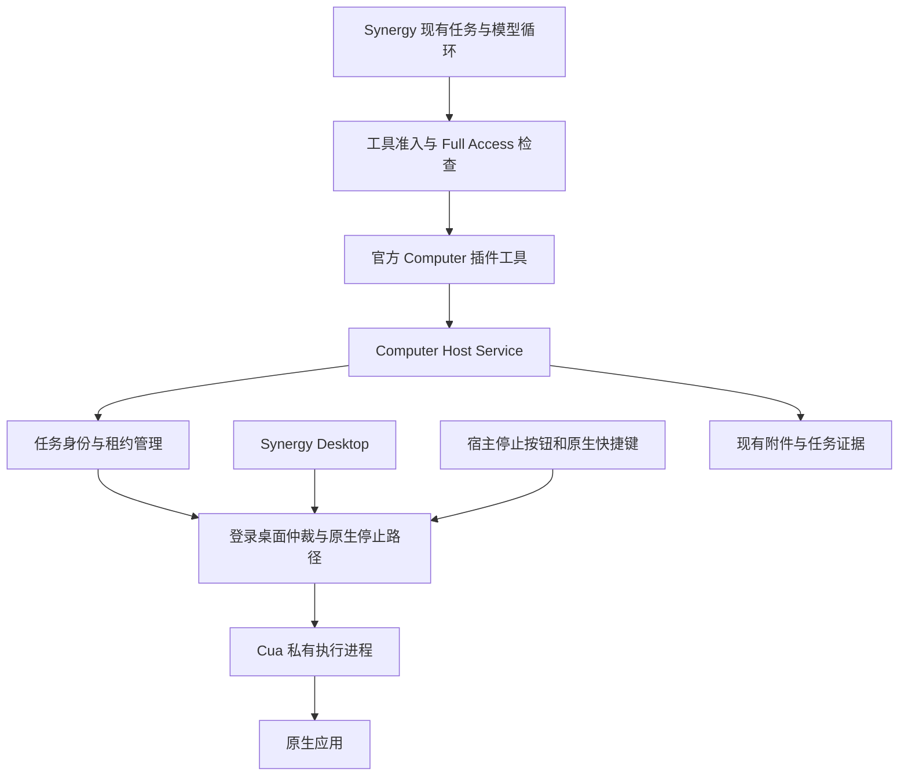

# Cua 与 Synergy Plugin 接入评估

This investigation includes alternatives considered before selecting native, window-targeted background integration. The [native Computer decision](../decisions/implemented/feature/2026-09-07-first-party-computer-use.md) owns the selected scope.

## 范围与结论

日期：2026-09-07；Synergy 基线：`81d568a8b`。本次从 [Plugin API4](../plugins/README.md)、源码、已有测试及 Cua 上游嵌入说明评估接入方式，承接 [开源方案调查](2026-09-07-computer-use-open-source-landscape.md)。这是未来实现建议，不是已发布能力。

可以将 Computer Use 的工具、配置和业务界面作为官方 Synergy 插件交付。对于 [正式能力提案](../decisions/implemented/feature/2026-09-07-first-party-computer-use.md) 的要求，此备选方案采用“官方插件 + Computer Host Service + Desktop 管理的 Cua 执行进程”；最终选择已改为原生支持，见决策记录。Cua 的原生驱动属于 Desktop 管理的运行组件；插件通过公开服务使用它。安装一个通用 MCP 插件可以缩短原型路径，但当前平台还不能仅凭这份声明提供 Full Access 专属准入、跨 runtime 桌面独占和原生立即停止。

本次完成了插件 manifest 的内存生成验证，没有安装插件、下载运行包、编译 Cua、启动 native daemon 或操作桌面。Cua 默认分支的 TypeScript 包声明版本为 `0.23.2`；这不证明同版本已发布、产物完整或与 Synergy 的 Bun/Electron 组合兼容。

## 当前平台已经具备什么

| 需求               | 当前证据                                                                                                                                                         | 可以直接利用的部分                                                             |
| ------------------ | ---------------------------------------------------------------------------------------------------------------------------------------------------------------- | ------------------------------------------------------------------------------ |
| 声明 MCP           | [MCP schemas](../../packages/plugin/src/mcp.ts)、[contribution](../../packages/plugin/src/contribution.ts)、[注册桥接](../../packages/synergy/src/plugin/mcp.ts) | 本地 argv、环境变量、手动/懒启动、工具过滤、连接与调用超时                     |
| 按配置启用         | [声明解析](../../packages/synergy/src/plugin/lifecycle.ts)、[行为测试](../../packages/synergy/test/plugin/settings-conditioned-mcp.test.ts)                      | `enabledWhen` 与设置更新后的服务器集合替换；这是配置条件，不是有效控制模式检查 |
| 正式插件工具       | [tool-source](../../packages/synergy/src/plugin/tool-source.ts)                                                                                                  | 每次调用注入 Scope、Session、Agent、message/call/root user message 和取消信号  |
| 插件能力审批       | [capability](../../packages/synergy/src/plugin/capability.ts)、[运行时规则](../plugins/runtime-and-permissions.md)                                               | 声明能力、安装授权、具体调用再校验；需要新增 Computer 能力和运行时映射         |
| 图片与界面         | [公开 context](../../packages/plugin/src/context.ts)、[UI 文档](../plugins/ui-contributions.md)                                                                  | Host-owned 图片附件、工具结果、设置和受信任 UI contributions                   |
| 插件取消和版本代次 | [context-factory](../../packages/synergy/src/plugin-runtime/context-factory.ts)、[manager](../../packages/synergy/src/plugin-runtime/manager.ts)                 | 单次调用取消、旧代次结果拒绝和插件进程管理；不代表 Cua daemon 已停止           |

公开 `PluginInvocationContext` 没有 `computer` 服务，也没有权威的有效控制模式字段。普通 Session 读取不能代替集中解析继承模式和与执行竞争的撤销。插件 runtime 是一个 Synergy runtime 内跨 Scope 共享的代次；模块级 mutex 无法协调另一个 runtime/home 对同一桌面的输入。

当前 `MCP.convertMcpTool()` 在 [mcp/index.ts](../../packages/synergy/src/mcp/index.ts) 中调用 `client.callTool()` 时只传工具名、参数和超时选项，没有转发调用取消信号或注入 Synergy 的任务所有者。[工具解析器](../../packages/synergy/src/session/tool-resolver.ts) 可以在上层取消时终结结果，但物理执行仍由下游负责。这是接入时必须验证和补齐的路径，不应将超时错误当作原生停止确认。

## 三种交付路线

| 路线                           | 核心改动                                           | 能解决什么                              | 取舍                                                                                                      |
| ------------------------------ | -------------------------------------------------- | --------------------------------------- | --------------------------------------------------------------------------------------------------------- |
| 仅声明 Cua MCP 的插件          | 注册本身不需要新 API                               | 已安装 Cua 的连接与工具暴露             | 适合作为接口原型；不满足完整产品要求，不能用设置开关冒充 Full Access gate                                 |
| 插件自带独立 Cua companion app | 仍需要可信任务授权、模式撤销和原生控制集成         | 可独立发布有自己签名与权限归属的应用    | 多一套应用分发/升级/权限体验；现有插件安装器没有现成的 Electron 原生 companion 管理服务，不是首版最短路线 |
| 官方功能插件 + 宿主服务        | 增加 Computer 服务、Desktop 原生生命周期和集中准入 | 复用插件分发/UI，保留任务控制的宿主权威 | 推荐；插件可选，但所需 Desktop 运行组件与 host API 必须存在                                               |

外部插件运行在普通进程中，现有能力审批约束 Host Services，不能对任意插件直接调用 OS 的行为提供沙箱保证。因此纯插件技术上可以自己启动自动化程序，但这不建立 Synergy 对受管理 Computer 能力的产品保证。正式实现不通过导入私有模块、直接 HTTP token 或 `shell.run()` 绕过缺失的宿主服务。

## 声明式原型验证

下面的定义已通过当前仓库的 `compilePluginManifest()` 在内存中生成 API4 manifest。测试只证明声明被接受；没有启动 `command`，没有证明 PATH、macOS 权限或任何桌面动作可用。

```ts
import { definePlugin, mcp } from "@ericsanchezok/synergy-plugin"

export default definePlugin({
  id: "computer-cua-probe",
  version: "0.0.1",
  description: "Metadata-only Cua MCP integration probe",
  contributions: [
    mcp({
      id: "driver",
      server: {
        type: "local",
        command: ["cua-driver", "mcp"],
        startup: "manual",
        toolFilter: { include: ["list_apps"] },
      },
    }),
  ],
})
```

这个示例不作为正式启用配置。即便只枚举应用，也应遵守用户要求的 Full Access 准入。`tools.approval: auto`、插件安装授权或 `enabledWhen` 都不表示 Full Access；不能靠这些字段使正式要求成立。

## 推荐的执行关系



插件负责动作工具描述、输入 schema、引导设置、结果呈现、使用说明和可选业务面板。它不接收 Cua socket 路径、原生客户端或可自行改权限模式的句柄，也不接受模型提供的 runtime/Scope/task owner。宿主从真实调用上下文解析所有者与有效模式，并将取消信号绑定到对应的 native command。插件只是工具入口；宿主保存控制权和暂停状态。

新公开服务可先定义有限的 `status`、`acquire`、`observe`、`perform`、`release` 操作，名字与类型在实现时冻结。观察和动作是有界结构化请求，不开放任意 Cua tool name、原始 socket JSON 或脚本。`acquire` 在模型工具调用中绑定当前根用户任务；租约跨多个工具调用保留，不能在每次点击后释放。`release` 只释放调用者拥有的租约。控制面必须重验插件 ID/代次、贡献声明、Scope/Session/根任务、有效模式及租约代次。

建议添加插件能力 `computer.observe`、`computer.interact`，集中映射到提案中的 `computer_observe`、`computer_interact` 执行分类。除不读取桌面内容的安装/可用性状态外，枚举、截图、辅助功能树与输入均只允许有效 `full_access`。检查同时位于工具准入和实际 Host Service 派发，防止 UI/SDK operation、延迟调用或模式切换绕过。声明能力得到安装授权不替代这个条件。

全局 Stop、人工接管、解除暂停仍是宿主用户控制。Stop 不依赖插件 handler 成功响应；插件面板可以显示状态并引导用户使用宿主控制，但不授予模型可调用的 resume。原生快捷键和接管监测必须在模型、插件、renderer 或控制面无响应时仍能阻止后续输入。插件卸载/禁用、代次更新和任务结束由宿主主动撤销对应租约，不能只依赖插件 uninstall hook 或旧进程的 finally。

只通过公开 API4 的增量 Host Service 扩展实现调用，不需要仅为增加方法而提高 IPC protocol 版本。插件按实际包含这些服务的 Synergy 版本声明兼容下限。首版不增加泛用 native plugin、任意 driver 注册或后端热切换 API。

## Cua 的具体连接选择

Cua 上游提供直接 SDK、独立 CuaDriver.app 和嵌入私有 daemon 三种路径。[U1] Synergy 推荐验证 daemon 路径：在 Desktop 的责任链内启动固定版本的执行组件；由受监督的 native host 持有执行器和独立停止路径。Cua 的 `EmbeddedCuaDriverHost` 可复用启动、generation、退出观察和清理机制。原生仲裁与停止监测的确切进程布局需通过卡死、崩溃和实际输入测试确定；仅让 Electron main 调用 `embedded.stop()` 不满足独立紧急停止要求。

应用调用优先比较生成 SDK 与 host-private MCP client，二者都位于受信任的 Cua 接入层，而非作为第二份模型工具集合暴露。SDK 依赖 `@ubjs/core` 与 `@ubjs/node`，需要验证实际 Electron/native addon 打包。若 SDK 包装兼容性不合适，可评估私有 MCP proxy；该选择仍须传播取消并校验任务归属，不能直接依赖当前通用 MCP 转换函数的行为。[U2, U3]

Cua 的生命周期 session 用于 transport 和清理，不等同于 Synergy 的业务 Session 或整台桌面的独占租约。上游 `session.rs` 有 ended tombstone 和显式 revival，`start_session` 可以重新启用已结束名称。宿主应为每次授权代次创建独立 Cua session，并屏蔽模型直接 start/end/revive/configure；接管后必须先通过宿主用户恢复再建立新代次。[U4, U5]

Cua 的权限模式在启动时固定。正式 Full Access 路线可评估其受信任 launcher 的 unrestricted 模式，同时继续执行 Synergy 的每调用准入、撤销和 OS 权限检查。模式参数不进入模型输入或普通插件设置；不在同一个 Cua daemon 上混跑非 Full Access 任务。不要把 Cua 模式名称机械映射为 Synergy 三种控制模式。[U1]

## 打包与仓库改动范围

| 位置                                                  | 最小必要变化                                                                |
| ----------------------------------------------------- | --------------------------------------------------------------------------- |
| `packages/plugin`                                     | Computer Host Service 类型、能力使用定义和错误数据；保持 API4 增量兼容      |
| `packages/synergy/src/plugin-runtime` 与 `src/plugin` | Host RPC 注入/派发、贡献能力校验、代次关闭时的 Computer 撤销                |
| `packages/synergy/src/computer`                       | 公开服务实现、任务归属、集中模式检查、命令状态、证据与 native host 连接     |
| 现有 enforcement/control-profile/session 集成点       | Computer 分类与硬准入、任务结束/模式变化撤销；不复制状态模型到插件          |
| `packages/desktop`                                    | 固定 Cua 版本的原生组件、权限归属、私有连接、监督与独立停止、签名/打包/升级 |
| 官方 Computer 插件                                    | `definePlugin()`、工具、设置、文档与 UI；目录和发布身份在实现时确定         |
| `packages/app` / `packages/ui`                        | 复用已有插件呈现；宿主提供不可被插件故障阻塞的全局控制状态和 Stop/恢复入口  |

当前 Desktop 构建只把 `electron` 标记为 external；[构建配置](../../packages/desktop/package.json) 和 [打包资源](../../packages/desktop/electron-builder.json) 没有 Cua 组件。新增依赖时需核实生成 SDK 动态资源、native addon 及 daemon 的实际打包位置，不能假设 Bun bundle 或现有 `**/*.node` 解包规则会覆盖全部文件。[U2]

初版建议将经过验证的 Cua 组件随 Desktop 的签名产物发布，插件保持可选启用。驱动可执行文件放在 ASAR 外，嵌套签名、执行位、架构、协议/SDK 配对和升级行为进入 Desktop 发布验证；不由插件安装时在线下载 latest 或修改已经签名的应用包。如果希望插件独立下载 native runtime，应另行设计有签名和版本校验的组件分发能力，不能假定现有插件系统已提供它。

## 验证顺序与未决项

1. 已完成：当前 API4 能生成 Cua MCP 声明的 manifest；检查现有工具上下文和 Host Service 注入；检查 Cua 嵌入与 session 源码。
2. 下一步：锁定源码/发布产物，验证 Node/Electron SDK 导入、最小 host 编译及包内资源完整性。此阶段不需要桌面输入。
3. 再验证：受控 fixture 中的权限归属、观察/输入、中文输入与坐标转换；两个隔离 runtime 竞争同一个 native arbiter。
4. 发布前必须验证：立即停止、人工接管、卡死与崩溃、旧代次回包、模式降级、卸载/升级撤销和暂停跨重启保持。取消 client、结束 Cua session、daemon 退出和物理输入停止分别记录，不合并为一个成功指标。

本次没有验证 Cua 的 signed release、停止延迟或任意应用覆盖，也没有选择最终 SDK/私有 MCP transport。推荐的是交付与所有权设计；正式能力仍需提案中的行为验收。

## 上游来源

| 标识 | 来源                                                                                                                                                       |
| ---- | ---------------------------------------------------------------------------------------------------------------------------------------------------------- |
| U1   | `https://github.com/trycua/cua/blob/main/libs/cua-driver/rust/Skills/cua-driver/EMBEDDING.md`，应用责任链、运行模式与嵌入要求                              |
| U2   | `https://github.com/trycua/cua/blob/main/libs/cua-driver/typescript/package.json`，源码包版本、导出和依赖                                                  |
| U3   | `https://github.com/trycua/cua/blob/main/libs/cua-driver/rust/crates/cua-driver-sdk/src/embedded.rs` 与 `typescript/src/embedded.ts`，进程所有权与生命周期 |
| U4   | `https://github.com/trycua/cua/blob/main/libs/cua-driver/rust/crates/cua-driver-core/src/session.rs`，清理、ended 状态及 revival                           |
| U5   | `https://github.com/trycua/cua/blob/main/libs/cua-driver/rust/crates/cua-driver-contract/src/session.rs`，公开生命周期工具语义                             |

上游地址是调查定位，不是已经采用的依赖锁定；本仓库没有复制上游源码。
