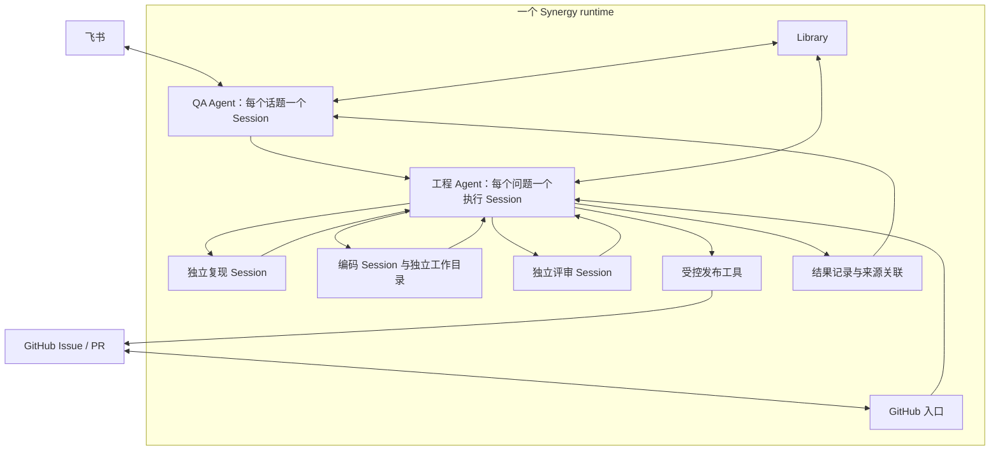

# Synergy Oryn：飞书反馈到 GitHub PR 的自动化方案

日期：2026-09-07。类型：研究参考与设计提案。状态：名称、仓库与单 runtime 方向已确定，产品改造未实现、未部署；本文不改变产品当前行为，也不授予生产写入或合并权限。

开发实施以 [详细 proposal](../decisions/proposed/architecture/2026-09-07-synergy-oryn.md) 为准；本文保留调研过程与外部证据。交接开发者使用 [开发 prompt](2026-09-07-synergy-oryn-handoff.md)。

## 结论与资源约束

在一个 Synergy runtime 中实现“反馈受理、证据生产、修复交付”的闭环：QA、工程执行、复现和评审使用不同 Agent 定义与独立 Session，复用现有 worker pool、SessionInbox、Boss/Cortex 和权限系统。不另建 coordinator 服务或跨实例任务队列。产品名称确定为 `synergy-oryn`，公开仓库为 [yzxoi/synergy-oryn](https://github.com/yzxoi/synergy-oryn)，采用保留 Synergy 历史的独立仓库。QA 与 GitHub 是同一产品的角色与入口，不拆两套内核。

目标是覆盖全部反馈，包括使用问题、CLI、服务端、Web、飞书和原生桌面问题；无法可靠复现或缺少目标平台时，保留证据并转人工。覆盖全部入口不等于承诺所有问题自动修复。

已知资源为 GitHub、飞书 Apps，以及无公网 IP、Linux、20 核 / 80 GB、不能运行 Docker 的 VPS。第一版不依赖 Docker、Kubernetes、Cloudflare、Convex 或公网回调服务。暂按 VPS 可以主动访问 GitHub、飞书、依赖源和模型 API 设计；网络、管理员权限、user namespaces、cgroup 与图形环境仍需部署前探测。若禁止 Docker 的原因也涵盖其他 namespace 沙箱，不能用换一个工具名称的方式绕过该限制。

20 核 / 80 GB 足以启动有明确并发上限的试点。是否需要更大机器应由构建峰值、浏览器内存、模型限流与任务等待时间决定，而不是由 Agent 数量决定；本文容量数字是初始配额建议，不是压测结论。

## 仓库初始化状态

[yzxoi/synergy-oryn](https://github.com/yzxoi/synergy-oryn) 是公开的独立仓库，保留下面 Synergy 基线提交的可达历史与原有许可证。只导入该公开源码历史，没有镜像其他本地分支、未提交文件或运行数据。初始化通过 `codex/oryn-bootstrap` 导入对象，在同一个 SHA 上创建默认 `dev`；没有向 Synergy 上游推送。

`dev` 已设置 PR 批准要求：至少一份批准、旧批准随新提交失效、最近一次可审阅 push 需由其他人批准、讨论需解决，且对管理员生效；禁止强推与删除。仓库自动合并关闭。`oryn/delivery`、领域 reviewer 和证据检查尚未实现，因此还没有将这些名称配置成 required checks。仓库目前仍是原始 Synergy 源码与 README；本提案保存在调研 worktree，尚未作为新提交发布。

## 调研基线与方法

| 对象        | 核对版本                                   | 核对范围                                                                 |
| ----------- | ------------------------------------------ | ------------------------------------------------------------------------ |
| Synergy     | `81d568a8b4a0378d8b52cb4f4c8eee2ac17baab3` | 新 worktree HEAD；远端 `dev` 在核对时相同；GitHub 默认分支也确认是 `dev` |
| OpenClaw    | `4c2acea8ecc4c9435198fae19287faa7e121e9af` | 浅克隆；QA Lab、Mantis runner、发布器、场景工作流与相关测试源码          |
| ClawSweeper | `6cd409f54dbb8c6f97dd07c46aa8631d180dfa88` | 浅克隆；调度设计、issue intake、修复策略、结果发布与相关测试源码         |

这是源码和测试用例阅读，不是生产运行审计。没有运行外部仓库脚本、真实飞书测试、模型基准或云端部署。Synergy 的相关产品文档、架构文档、README、配置 schema 与实际源码交叉核对；代码与注释不一致时，以代码和行为测试为准。

仓库命名需要澄清：访问 `openclaw/mantis` 在调研时重定向到 `openclaw/clawsweeper`；本文的 Mantis 指 OpenClaw 主仓库中现存的 QA / 视觉证据子系统，不把这个重定向解释成两个子系统完全相同。

## Synergy 已经具备什么

| 能力                       | 当前源码证据                                                                                                                                                                                                                           | 对方案的意义                                                             |
| -------------------------- | -------------------------------------------------------------------------------------------------------------------------------------------------------------------------------------------------------------------------------------- | ------------------------------------------------------------------------ |
| 飞书长连接与话题绑定       | [Feishu provider](../../packages/synergy/src/channel/provider/feishu/index.ts)、[thread binding](../../packages/synergy/src/channel/provider/feishu/thread-binding.ts)                                                                 | 可复用收发、附件、线程和卡片；不需要公网 webhook                         |
| 关闭过程流式展示           | [配置 schema](../../packages/synergy/src/config/schema.ts)、provider 的 `createStreamingSession()`                                                                                                                                     | `streaming: false` 可先减少工具进度展示；不等于业务级静默交付已经完成    |
| GitHub 出站轮询            | [poll](../../packages/synergy/src/channel/provider/github/poll.ts)、[synthesizer](../../packages/synergy/src/channel/provider/github/synthesizer.ts)、[gate](../../packages/synergy/src/channel/provider/github/gate.ts)               | 已有 GitHub App、游标、去重和对话入口；不是从零做 GitHub 集成            |
| GitHub checkout 与 PR 交付 | [workspace](../../packages/synergy/src/channel/provider/github/workspace.ts)、[provider](../../packages/synergy/src/channel/provider/github/index.ts)、[delivery tool](../../packages/synergy/src/channel/tools/github-deliver-fix.ts) | 可借用鉴权和发布思路，但不能直接从任意飞书或云端子任务调用现有交付工具   |
| Session 与 Cortex          | [Cortex manager](../../packages/synergy/src/cortex/manager.ts)、[concurrency](../../packages/synergy/src/cortex/concurrency.ts)、[output](../../packages/synergy/src/cortex/output.ts)                                                 | 已有独立子 Session、结构化结果、并发队列、取消和恢复信息                 |
| Boss 分工与静默交付        | [Boss service](../../packages/synergy/src/boss/boss.ts)、[Channel outbound](../../packages/synergy/src/channel/outbound.ts)                                                                                                            | 已有持久 worker Session、幂等派单和显式 channel_push；不需要另建协调进程 |
| 定时与 GitHub 状态观察     | [Agenda](../product/automation.md)、[GitHub trigger](../../packages/synergy/src/agenda/github-trigger.ts)                                                                                                                              | 可承担夜间巡检和观察触发；不是跨机器工作单的唯一持久调度器               |
| 任务型 Channel 的先例      | [Channel host](../../packages/synergy/src/channel/host.ts)、[Clarus result outbox](../../packages/synergy/src/channel/provider/clarus/result-outbox.ts)                                                                                | 已有“任务分配、结构化交付、回执不确定”模型；无需把所有工作压回聊天       |
| Memory / Experience        | [encoder](../../packages/synergy/src/library/experience-encoder.ts)、[Library API](../../packages/synergy/src/server/library.ts)                                                                                                       | 可保存经验、检索知识、注入外部 reward；缺少本场景的学习闭环              |
| 无 Docker 的 Linux 沙箱    | [readiness](../../packages/synergy/src/sandbox/readiness.ts)、[Linux backend](../../packages/synergy/src/sandbox/linux.ts)                                                                                                             | 已有 helper / bubblewrap 路线，是否能用取决于 VPS 实际权限与内核         |
| 受支持的扩展与调用入口     | [Plugin delegation](../plugins/tools-and-delegation.md)、[Session API](../../packages/synergy/src/server/session.ts)                                                                                                                   | 业务工具可以做插件；会话控制和委派继续走既有公开接口                     |

需要明确的限制：

1. 普通飞书路由以远端消息映射 Session，再自动投递结果；实验性 Runtime Boss 已经采用显式 channel_push，不自动转发终止回复或内部汇报。不能把普通路由的限制推广到整个产品。Runtime Boss 将同账号所有对话汇入一个 Session，面向多人 QA 时建议保留按话题的会话，并补上可独立选择的显式交付策略。
2. GitHub `github-channel-agent` 当前同时承担问答、review 和修复，其权限白名单不包含普通 `task` 委派工具。把提示词改成“你是团队负责人”不会自动得到一条可靠流水线。
3. `github_deliver_fix` 要求当前 Session 自身绑定 GitHub endpoint，并在对应 thread checkout 找到分支。它不是任意 Worker 可调用的通用发布 API。从非 GitHub endpoint 的工程 Session 交付时，需要明确的工件与授权接口，不能伪造 endpoint；这不要求独立发布服务。
4. GitHub synthesizer 忽略所有 login 以 `[bot]` 结尾的评论。不能把“机器人评论里 @另一个机器人”作为派单协议。普通 PR head push 也不会触发自动重审；[对应测试](../../packages/synergy/test/channel/provider/github/synthesizer.test.ts)明确覆盖这一点。
5. `autoRespond` 同时控制新 issue 和 mention 的对话唤醒，当前 gate 不是本方案所需的成员授权、风险分级和任务预算系统。不能把收到一条公开 issue 当作获得任意执行授权。
6. Cortex 的并发上限是进程内的，不是整个 VPS 的总配额。默认全局 8、每 agent key 8，内存压力会进一步降低准入。每个 Session 的 LLM loop 仍是串行的；同一 runtime 的多个 Session 可以并行执行。
7. Cortex 子任务继承父 workspace；父 Session 已在 worktree 时，不会自动再创建一个嵌套 worktree。因此不能让同一父 worktree 的多个编码子任务同时写代码，并声称它们已经隔离。
8. 重启后原本活跃的 Cortex task 会进入 `interrupted`，这提供恢复依据，不代表任务会安全地自动重放所有外部操作。`maxCost` 在结果发布前检查已发生的费用，也不是调用前硬限额。
9. Library 按安装实例存储。Experience encoder 跳过 child Session 和 synthetic turn；多实例不会自动共享学习结果。已有 `library.experience.applyReward` API 可利用，但调用方还须保存结果到 Experience 的映射与去重依据。

当前机制的完整定义继续以 [Channels](../architecture/channels.md)、[GitHub Channel](../architecture/github-channel.md)、[Cortex](../architecture/cortex.md)、[Knowledge](../product/knowledge.md) 为准。

## OpenClaw、Mantis、ClawSweeper 的可借鉴部分

### OpenClaw / QA Lab：统一场景描述，分开执行环境

QA Lab 将场景、provider 模式、channel driver 和证据输出分开，既支持 synthetic channel，也支持真实传输。其 synthetic `qa-channel` 经过正常 Channel 插件入口，能检查线程、附件、reaction 和重复投递等行为，但不能因此声称飞书官方服务已经通过验证。

适合借用的是“同一行为断言可以在不同真实性等级的环境中运行”。Synergy 可先使用现有测试和独立 home 建立快速场景，针对飞书真实通道补少量专用 canary；没有必要移植 OpenClaw 的整个 QA Web 站点。

来源：[QA overview](https://github.com/openclaw/openclaw/blob/4c2acea8ecc4c9435198fae19287faa7e121e9af/docs/concepts/qa-e2e-automation.md)、[QA channel](https://github.com/openclaw/openclaw/blob/4c2acea8ecc4c9435198fae19287faa7e121e9af/docs/channels/qa-channel.md)。

### Mantis：负责证明具体行为

Mantis 包含 baseline / candidate 执行、截图或视频、证据 manifest、PR 证据发布等机制。重要的区分是：真实 Discord 场景对比与使用 mocked Gateway 的候选 Web UI proof 证明的范围不同；截图也可能由观察结果渲染而来，而非真实客户端截屏。

实际源码中，`run.runtime.ts` 的本地 runner 仍产生 schema version 1，而 `publish-pr-evidence.mjs` 要求 version 2，并校验各 lane 的 `expectationMet`。文档也明确指出这一不匹配。`mantis-scenario.yml` 是有限场景的手动 dispatcher；当前文档不再承诺 `@clawsweeper mantis ...` 是专门的自动派发命令。这说明值得复用的是证据原则，不是把名字当作已经完整打通的产品承诺。

Synergy 应学习：固定源 SHA、固定验证场景、记录断言和原始观察、区分基础设施失败与行为失败、发布一份可复核结果。暂不引入 Crabbox、Convex 和 R2 的整套部署依赖。

来源：[Mantis 文档](https://github.com/openclaw/openclaw/blob/4c2acea8ecc4c9435198fae19287faa7e121e9af/docs/concepts/mantis.md)、[runner](https://github.com/openclaw/openclaw/blob/4c2acea8ecc4c9435198fae19287faa7e121e9af/extensions/qa-lab/src/mantis/run.runtime.ts)、[publisher](https://github.com/openclaw/openclaw/blob/4c2acea8ecc4c9435198fae19287faa7e121e9af/scripts/mantis/publish-pr-evidence.mjs)、[dispatcher](https://github.com/openclaw/openclaw/blob/4c2acea8ecc4c9435198fae19287faa7e121e9af/.github/workflows/mantis-scenario.yml)。

### ClawSweeper：模型做判断，程序控制外部动作

ClawSweeper 把 intake、review、repair、publish / apply 分开。它维护明确的 job intent、按任务类型分配容量、保存结果与动作账本，并在写 GitHub 前核对当前目标。issue implementation intake 检查已有 PR、保护标签、报告版本和重试记录；评论使用 marker 定位并编辑既有评论，以降低噪声。review/fix 与 merge authorization 是不同的状态。

它已经发展成 Actions、Worker、R2、state repo 与 CrabFleet 协作的较大系统。对于一台 VPS 和一个目标 repo，直接部署完整 ClawSweeper 再替换其 Codex 执行层，未必比复用 Synergy 自身能力更短。建议借用它的动作账本、去重、状态复核、限额与评论更新方式，把模型执行保留在 Synergy。

来源：[orchestration](https://github.com/openclaw/clawsweeper/blob/6cd409f54dbb8c6f97dd07c46aa8631d180dfa88/docs/orchestration.md)、[repair architecture](https://github.com/openclaw/clawsweeper/blob/6cd409f54dbb8c6f97dd07c46aa8631d180dfa88/docs/steerable-repair-automation.md)、[issue intake](https://github.com/openclaw/clawsweeper/blob/6cd409f54dbb8c6f97dd07c46aa8631d180dfa88/src/repair/issue-implementation-intake.ts)、[intake tests](https://github.com/openclaw/clawsweeper/blob/6cd409f54dbb8c6f97dd07c46aa8631d180dfa88/test/repair/issue-implementation-intake.test.ts)。

## OpenClaw 实际 issue / PR 给出的约束

以下样本读取于 2026-09-07，包括 PR 正文、关联 issue、持久 review 评论与历史；状态与正文可能继续变化。这是对公开证据的核对，没有独立执行其中的测试。报告者的根因解释与 reviewer 的判断都须和直接观察区分，不能因为出现在 GitHub 就视为已经证实。

| 样本                                                                                                                                         | 观察到的过程                                                                                                                         | Oryn 采用的规则                                                                                |
| -------------------------------------------------------------------------------------------------------------------------------------------- | ------------------------------------------------------------------------------------------------------------------------------------ | ---------------------------------------------------------------------------------------------- |
| [Issue #136200](https://github.com/openclaw/openclaw/issues/136200) → [PR #136231](https://github.com/openclaw/openclaw/pull/136231)，已合并 | 引用合并转发消息只看到占位符。作者修正了被旧 Gateway 抢收事件干扰的早期结论；最终给出候选构建、唯一 WebSocket 接收者与真实回复的证据 | 验证前记录构建来源和消息接收实例；不能把控制台 ready 或模型答复当作候选代码实际执行的证明      |
| [PR #136231 的评审记录](https://github.com/openclaw/openclaw/pull/136231#issuecomment-5507725923)                                            | 先要求真实行为证据，后续又发现转发内容没有总长度限制；最终冻结 head 上重新评审，结论仍是交人类审阅                                   | 行为修复与上下文容量、异常处理、产物打包分别审查；通过过一次的 PR 在新版本仍可能出现 blocker   |
| [Issue #43690](https://github.com/openclaw/openclaw/issues/43690) → [PR #136382](https://github.com/openclaw/openclaw/pull/136382)，已合并   | 多表格内容在控制台可见却没有送达飞书。PR 给出五张表仍使用卡片、六张表改走 post 的 API 接受证据                                       | 从用户收不到回复的症状建模；同时验证限制内行为不退化、限制外确实送达                           |
| [PR #136382 的评审记录](https://github.com/openclaw/openclaw/pull/136382#issuecomment-5511901830)                                            | 多轮评审分别指出启动失败的 fallback 漏检、静态表格限制误伤 streaming；旧 finding 在后续版本逐项验证                                  | Reviewer 要读取相邻分支和失败路径；返工按 finding 闭环，不因主路径测试通过而清空历史问题       |
| [PR #137381 的评审记录](https://github.com/openclaw/openclaw/pull/137381#issuecomment-5528348023)，读取时仍打开                              | 没有新增可行动代码 finding，但存储兼容、失败后继续执行、异常路径耗时与 owner 决策仍未完成；历史区记录了 119 个较早周期               | `no_findings` 不等于交付合格；设计决策转人工，自动返工有上限，不能反复评审代替决策             |
| [Issue #97886](https://github.com/openclaw/openclaw/issues/97886)，读取时仍打开                                                              | 报告能发消息、能收到生命周期事件，却收不到消息事件；版本、平台和订阅设置明确，但握手根因只是报告者推测                               | 接受可观测症状，分离订阅配置、身份权限、连接归属与代码故障；未复现时交付排查证据，不强行改代码 |

另一个 [Issue #140605](https://github.com/openclaw/openclaw/issues/140605) 报告了新版本、不同模型上仍出现内部上下文泄露。这类后续报告要核对原修复覆盖面和实际发布版本，不能因已有相似 PR 就自动关闭。此处只引用公开报告，不认定其所有技术推断已经成立；Oryn 自己收到可能的漏洞反馈时按 Synergy SECURITY 流程私下处理。

OpenClaw 将确定性分诊与模型评审分开，并明确自动评审不是人类批准；PR 正文是持续更新的交付摘要。Oryn 借用这些原则，但不照搬它的评分等级、贡献者数量阈值、自动关闭规则或成员证据豁免；我们需要的严格程度由变更影响决定，内部 Agent 的 PR 也不能免证据。[评审流程](https://github.com/openclaw/openclaw/blob/4c2acea8ecc4c9435198fae19287faa7e121e9af/docs/reference/pull-request-review-flow.md)、[PR 模板](https://github.com/openclaw/openclaw/blob/4c2acea8ecc4c9435198fae19287faa7e121e9af/.github/pull_request_template.md)。

## 推荐系统结构

runtime 负责实际调度与权限；工程 Agent 负责判断下一步需要谁；发布工具负责核对目标、代码版本和回执。三种职责并不要求三个服务。源码中的 Agent worker 是 provider turn 执行进程，不等于固定 QA 或编码身份；角色属于 Session。

### QA 的职责与会话粒度

QA 负责答疑、必要澄清、反馈提交和结果解释，可以读取代码与 Library；长时间复现和编码交给工程 Session。每个飞书话题保留独立上下文，一个话题中的多个独立问题可以关联不同工程 Session。一次 QA 回合结束不会取消后台工程工作。

普通路由可先采用 streaming: false 与 group_thread。最终复用 Boss 的显式 channel_push 交付思想，让 QA Session 只发有用答复；这项通用交付策略需要从当前 Boss 专属判断中提炼，不能声称普通 Channel 已经拥有该选项。不要直接把实验性 Runtime Boss 的账号级聚合打开作为多人 QA 的最终方案。

### 工程分工与现有机制

每个独立问题拥有工程执行 Session，由工程 Agent 在同一 runtime 内分配复现、编码与评审。持久职责与分层汇报可复用 Boss；有界专家任务可使用 Cortex。Boss worker 默认属于 Boss workflow，不能未经设计就同时叠加 Light Loop 或 BlueprintLoop；需要审计循环时选择一种明确路径，或创建独立的普通执行 Session。

BossService.spawn 已支持 workspace=worktree，assign 使用 SessionInbox.deliverUnique，worker 通过 report 唤醒直接父 Session。跨 Scope 的 QA 与工程 Session 可以复用 session_send；不能把跨 Scope 会话强行接成一个不合法的 Boss 父子树。隐藏 Agent 的可见性与 Host 授权规则仍然生效，不是所有 builtin Agent 都能任意互相委派。

短期采用一份 Synergy 集成 fork 孵化专用形态是可行路径；QA 与 GitHub 共用同一内核、按角色配置和工具差异化。通用改动回到 Synergy；产品特定的反馈关联和验证场景可做插件或一个聚焦的产品模块。不建立 QA/GitHub 两套长期分叉内核，也不先拆独立 coordinator 仓库或数据库。

### Oryn 对 Boss 的具体改造范围

保留 Boss 的派单、直接父子汇报与 Inbox 恢复能力，改变它的入口和交付模型。以下角色名为设计名称，不是当前已注册 Agent：

| Agent         | 会话与工具职责                                                                      | 结束条件                                                          |
| ------------- | ----------------------------------------------------------------------------------- | ----------------------------------------------------------------- |
| `oryn`        | 每个飞书话题一个 QA Session；读代码、Library、提交反馈和查询结果，默认不直接改代码  | 用户疑惑得到答复，或反馈已持久交给工程 Session                    |
| `oryn-work`   | 每个独立问题一个 Boss 工程 Session；选择复现、编码、验证、评审，消费结构化报告      | 形成合格 PR，或附具体原因转人工                                   |
| `oryn-repro`  | 独立 Session；在对应环境建立失败断言、验证原版与候选；验证用全新 Session 和冻结工件 | `reproduced`、`verified`、`inconclusive` 或 `needs_human`，附证据 |
| `oryn-code`   | 一次候选由一个 Session 拥有写权限；在自己的 worktree 修复并产出提交候选             | 返回候选、测试变化、影响面和未解决项                              |
| `oryn-review` | 从 issue、diff、原始观察和测试产物独立判断；按风险追加领域评审 Session              | 结构化 findings、证据判定、设计待决项与建议结论                   |

同一个 Agent 定义可以拥有多个并行 Session；不是每个角色常驻一个无限增长的大会话。`oryn-work` 承担必要的工程判断，runtime 承担执行调度；不增加独立 coordinator 进程。普通任务用一次独立评审，持久化、权限、凭据、发布与 channel 语义等高风险变更追加对应领域评审，不固定让所有问题都经过许多模型。

飞书受理和工程执行通过持久反馈关联连接。跨 Scope 由明确的 Host 授权入口创建工程 Session，发送可信 Inbox 事件；普通 `session_send` 只提供传递能力，不代表任何会话可以授权发布。每个事件同时携带不可变来源锚点和任务版本，不能使用 Boss Session 的“最后收到的飞书消息”决定结果接收者。

核心改造集中在四处：将显式 Channel 交付从 Boss 角色判断提炼为受控策略；加入允许的 Oryn Agent 委派组合；保存来源与验证/发布关联；把 GitHub 交付从 endpoint 专属工具提炼为 Host 校验的窄操作。既有 Boss 功能保持兼容，Oryn 入口选择自己的策略，不全局替换普通 Synergy 用户的工作模式。

通用改动逐批向 Synergy 上游提交；Oryn 特定的 prompt、产品默认值、飞书答复策略与 GitHub 交付要求留在专用模块。先建立固定上游 SHA 的同步检查与 Oryn 回归场景，再更新内核，避免两套长期独立演进的 QA / GitHub fork。第一批无需全仓重命名包、CLI、环境变量和历史文档。

### 仍需补齐的业务接口

需要保存反馈来源、工程 Session、GitHub issue/PR、验证 SHA 和发布回执之间的关联。这是一份小的持久业务记录，不是新的 Agent 调度系统。模型通过窄工具提交反馈或发布结果，身份从 Host 上下文取得；存储、迁移、锁与事件沿用现有 owning domain 规范。

GitHub 现有 delivery tool 只服务 GitHub endpoint Session。应提炼受控发布操作或增加经授权的工程任务关联，不让普通 Worker 任意操作 GitHub，也不从插件导入私有 provider 模块。GitHub 自动事件与 QA 提交必须去重到同一工程任务，避免旧 Channel 与新形态各开一个修复。

Agenda 用于真正的时间触发、回访和巡检；任务完成由 Inbox、Boss/Cortex 完成路径继续驱动，不增加周期性模型轮询。

## 用户实际会看到什么

| 情况                  | 飞书行为                                    | 后台行为                                 |
| --------------------- | ------------------------------------------- | ---------------------------------------- |
| 普通使用问题          | 给直接答案、必要的版本说明                  | 检索知识；没有必要就不建 issue           |
| 信息不足              | 一次集中询问关键版本、步骤或截图            | Case 等待补充，不空跑编码任务            |
| 疑似 bug              | “已记录，正在核实；后续结果会回复到这里”    | 保存私有 Case，脱敏、去重、复现          |
| 确认 bug              | 更新原受理消息中的 issue 链接；通常不额外 @ | 创建或关联 GitHub issue，记录证据        |
| 已有相同问题          | 给已有 issue / PR 和临时处理方法            | 关联现有 Case，避免重复修复              |
| PR 可审阅             | 一次通知：修复内容、验证范围、PR 链接       | 停在待审阅，不声称已发布                 |
| 已合并但未发布        | 查询时明确说明；通常不再推一次通知          | 等待 release 或部署记录                  |
| 已发布 / 可试用       | 对订阅者给版本或试用方式                    | 记录实际交付版本，必要时收集回访         |
| 无法复现 / 无目标环境 | 给已做检查、尚缺信息和转交对象              | 状态为 `needs_human`，不判定为“不是 bug” |

日常不展示读文件、工具调用、子任务开始/结束、重试、token 或内部思考。底层执行记录在 Synergy 工作台，Case 留简短审计；飞书只承担答复、必要澄清、需人介入和有用结果。状态查询随时响应，静默不等于没有可查状态。

GitHub 每个 Case 维护一条自动化状态评论，按 marker 更新；发现新的实质性 blocker 才增加必要讨论。飞书业务通知同样记录已投递版本和消息回执。两个平台之间传递的是业务事实与关联 ID，不是逐条转发聊天。

## 工作单、状态与恢复

执行状态优先来自已有 Session、Inbox、Cortex 或选定 workflow。第一版只增加必要的反馈关联记录：来源、工程 Session、repo、issue/PR、当前验证 SHA、证据引用、发布/通知回执。不要同时复制完整聊天记录和运行状态到另一个数据库。

Issue 负责工程协作，Session 保存执行历史，反馈关联负责把结果送回正确的人。Memory 不承担任务状态或发布回执存储。

复用与补齐的界限如下：

| 事项                          | 处理方式                                     |
| ----------------------------- | -------------------------------------------- |
| Session 执行队列与单会话串行  | 复用 runtime，不实现新 scheduler             |
| Boss 派单去重                 | 复用稳定 taskID 与 deliverUnique             |
| Cortex 子任务结果、取消与通知 | 复用现有实现；尊重重启后的 interrupted 状态  |
| GitHub issue / PR 发布重试    | 持久化 marker、分支与远端回执；超时先对账    |
| 原飞书话题与后台任务关联      | 新增窄的来源记录，避免使用会话的可变最后消息 |
| 验证与发布代码一致性          | 记录具体 baseline/head SHA，发布前核对       |
| 同一问题的重复提交            | 关联已有任务；不要仅凭文本相似就合并         |

对一个问题的同一代码版本，只允许一个编码 Session 写入；其他编码任务使用独立 worktree。评审读取冻结的候选工件。若 project 的多个 sibling worktree 都被列为可信 roots，autonomous 不保证它们彼此不可写；要核对实际写入 roots，而非只看目录不同。

外部动作采用至少一次尝试加幂等与对账。Inbox 派单去重不自动保证 GitHub、飞书或 reward 的副作用去重。重启、取消、补充信息和 PR head 变化时，先复核已有 Session 与发布回执，再继续必要工作。

角色设置复现与修复预算，超过后给出可行动的人工接手信息。Cortex maxCost 是执行后的费用检查，不能当作实时硬限额。限额能力复用或补在 owning runtime，不因此增加一个外部控制服务。

## 不使用 Docker 的部署

### 首选配置

VPS 第一版运行一个专用 Synergy runtime，启用 QA 与工程 Agent，按反馈建立独立 Session，复用 runtime 已有 Agent/Policy worker pool 和 ToolTask scheduler。先限制重型构建/测试并发为 2，真实飞书 E2E 并发为 1，为 QA 留出执行容量。

角色不要求分别运行一个 Synergy home。同 runtime 的 Library 可以复用，但检索范围、来源和敏感信息仍需控制。被测源码启动的 Synergy 必须使用另一个临时 home 和独立端口；它是被测系统，不是新增一个协调层。

工作目录、临时文件、浏览器 profile、显示会话和可写缓存按任务隔离。代码执行使用现有 autonomous 与 OS sandbox；autonomous 默认在沙箱不可用时拒绝相应执行，不能将不会弹审批等同于无沙箱也能运行。部署前实测 helper、bubblewrap、user namespaces、seccomp 与文件/网络规则。

只有出现明确的不同信任域、强资源隔离或跨机器需求时，才拆独立实例或远端执行环境；不要按 QA、复现、编码、评审四个角色预先拆四套服务。

### 隔离能力分级

| VPS 能力                                                | 允许的执行范围                                     | 处理其他任务的方式                                               |
| ------------------------------------------------------- | -------------------------------------------------- | ---------------------------------------------------------------- |
| 独立 UID + 可验证的 namespace / seccomp 沙箱 + 资源限制 | 允许策略范围内的 Linux CLI、服务端、Web 验证       | 高风险修改仍走专门评审；真实凭据场景在专属验证槽位               |
| 只有独立 UID / 目录，没有可靠 namespace 隔离            | 受信源代码的有限试点；明确保留同内核和网络访问风险 | 任意外来 PR 或不可信脚本送 GitHub 托管 VM / 其他独立 VM          |
| 连独立 UID / 资源约束也不能配置                         | QA、只读分析与工件管理                             | 编译、测试和不可信代码执行放 GitHub 托管环境；无合适环境则转人工 |

“不能开 Docker”不自动意味着 bubblewrap 被允许，也不自动意味着只能裸机无保护执行。先确认管理政策与实际能力；若 namespace 被禁，替代方案使用 GitHub 托管 VM 或申请独立 VM，而不是申请更多 CPU 来掩盖隔离缺口。

测试进程不获得 GitHub App 私钥、飞书生产 App secret 或runtime 管理权限。只剥离环境变量不够，还要隔离凭据文件、其他用户的 home、进程环境、SSH agent 与宿主管理端口。模型访问可由外层执行程序或受限代理提供，避免将长期模型密钥交给被测脚本。真实飞书验证使用测试 App 与专用测试会话，权限和配额独立。

### 网络与资源

飞书 provider 已使用 SDK WebSocket 主动连接；GitHub 由 runtime 的 Channel/受控工具出站轮询和写 REST API。第一版不需要 tunnel 或公网 IP。若后续采用 self-hosted runner，它也主动连接 GitHub，普通 shell job 不要求 Docker；但容器 action / service container 需要 Docker。不要把这台有长期状态的 VPS 直接开放成公开 PR 的任意 runner。[GitHub runner 要求](https://docs.github.com/en/actions/reference/runners/self-hosted-runners)。

建议初始容量：重型构建/测试总并发 2，真实飞书 E2E 并发 1，轻量问答/代码阅读总并发 4–6。每个重型槽位可以先按约 4 核、12–16 GB 上限规划，留下 QA、runtime、浏览器和系统缓存余量；允许的全部任务内存配额之和不能挤满 80 GB。实际限额按首批任务峰值调整。

Cortex 配额、外部 Session 数、测试进程配额和模型 API 并发需要一起计算。重型 admission 复用 runtime 调度，并按实际缺口增加角色或执行类别配额；不能在每个进程配置 8 后便声称系统总并发是 8。QA 应保留专门资源，编码排队不能拖慢受理与答复。

VPS 原始证据留本地受控目录，必要时上传飞书受限云盘/作为附件交付。GitHub 放脱敏摘要、断言和校验值；GitHub Actions 上产生的验证证据放对应 run 的 artifacts。不假设公网可以打开 VPS 文件路径，也不假设 GitHub 有任意上传 Actions artifact 的通用 REST 接口。

runtime 持久状态和原始证据要有第二份受控、加密备份；仅在同一块 VPS 磁盘复制一份不能抵御整机丢失。备份目的地可以使用现有受限飞书云空间或其他组织批准的存储，保留与访问策略在试点部署时确定。

## 全部反馈的验证矩阵

| 类型                     | 首选自动验证                                                        | 不能据此声称的结果                                        |
| ------------------------ | ------------------------------------------------------------------- | --------------------------------------------------------- |
| CLI / 核心服务端         | Linux 独立 home、精简 fixture、真实进程或 API；原版失败、候选通过   | 未执行的其他平台通过                                      |
| Web UI                   | 真实构建、浏览器自动化、DOM/网络断言、必要的截图                    | mock backend proof 等于完整真实系统通过                   |
| 飞书 Channel             | 快速 provider/路由测试，加测试 App 的真实接收、线程、回复、附件验证 | 注入合成消息等于飞书事件订阅已验证                        |
| Linux 桌面               | VPS 允许图形依赖时使用独立显示会话与真实 Electron                   | Xvfb 等于原生系统权限、托盘或安装体验已验证               |
| macOS / Windows 桌面     | GitHub 对应托管 runner 执行可自动化部分                             | runner 能覆盖登录桌面、签名权限、硬件及企业策略的全部问题 |
| 账号、网络或特定数据问题 | 脱敏复现样本、受控环境与必要的用户回访                              | 无法拿到原环境等于用户报告无效                            |

GitHub 提供 Linux、Windows、macOS 的托管 runner，但原生桌面权限、签名与交互场景仍需逐类验收。[托管 runner 说明](https://docs.github.com/en/actions/reference/runners/github-hosted-runners)。

每份证据至少保存：Case/Attempt 内部关联、repo、baseline SHA、candidate SHA、操作系统/运行时/依赖版本、场景、独立 oracle 或断言、模型真实或模拟、实际观察、结果类别、时间、工件校验值、脱敏状态与未覆盖范围。公开版本移除内部关联和敏感环境信息。

对 bug 修复，应在相同场景和兼容环境中看到原始失败与修复后通过。依赖安装失败、模型限流、网络不通或测试没有跑到关键操作，应判为 `inconclusive`。如果只在旧 release 失败而最新 `dev` 已通过，应关联既有修复或版本建议，不再开重复 PR。非确定性故障记录多次实验结果，不通过无上限重试筛选一次成功。

飞书 E2E 首先验证可用的驱动身份和事件接收路径，不假设两个 Bot 互相发消息就等价于真实用户操作。可采用允许的测试用户/客户端驱动，或人工发起一次固定场景后由系统自动观察；若身份与客户端条件不具备，就明确停在较低验证等级。

复现者先定义失败断言，编码者实现修复，验证者从冻结工件重跑，评审者检查行为与设计。编码者可以提出测试修改，但降低断言、移除失败测试、扩大排除项必须成为显式评审内容。生产凭据不能随 PR 测试运行；真实集成验证使用受控测试租户与已检查的执行入口。

## GitHub 发布与权限

人类描述症状，不需要替系统写出 GitHub issue 模板。QA 收集的结构化 Case 经脱敏后，由发布器创建 bug issue：预期/实际、版本、步骤、影响、证据与验证限制。无法复现但值得开发者介入时，也可以创建明确标记“待复现”的 issue；不要伪称确认。

发布器使用安装在目标 repo 的 GitHub App。最少按实际用途配置 Issues、Pull requests、Contents 的权限；Actions 调度、Checks 写入等按确实需要单独开放。模型不持有任意 GitHub 写入 token。issue / comment 输入只是任务数据，维护者或组织成员身份、repo allowlist、预算与允许操作来自宿主策略和实时身份核对。

允许的自动交付应预先限定为：创建/更新相关 issue、写入自动化拥有的 topic branch、创建/更新 PR、发布结果评论。PR 固定针对 `dev`，保护 `dev` / `main`，不直接推送；提交遵循仓库 conventional type 与 agent co-author 规则。真实反馈、绝对路径、Session/Scope ID、日志原文和凭据不进入 GitHub。

第一版不自动合并、不自动 release、不按“看起来重复”批量关闭 issue。PR ready、merged、released 是三个不同事实。已有人工 PR 默认只给建议，不能因为 Agent 判断可以修就修改贡献者分支；获授具体修复权限后仍核对 head SHA。

合并始终由人类执行。Oryn 不提供自动 merge 或 release 操作；即使自动评审通过，也只产生“可交人类审阅”的结论。GitHub App 的 Contents / Pull requests 写权限本身不能表达“可以创建 PR 但不许合并”，因此还要依靠受控发布器的操作白名单、分支保护和不向 Worker 暴露凭据共同约束。

## Reviewer 与 PR 交付规则

这部分是 Oryn 的目标行为，尚未成为运行中的检查。强 reviewer 需要独立输入、可检查证据和确定性的交付条件，不能只在 prompt 里写“严格审查”。评审通过也不授予合并权限。

### 独立评审与有界返工

复现者先记录用户可观察的失败断言；编码者读这些断言修复。验证者用新 Session 在干净的候选 checkout 重跑；reviewer 先看问题、变更与证据，再看编码者解释，避免把作者叙述当作结论。正常独立性由新上下文、不同权限和真实验证建立；高风险时再增加不同领域或不同模型的评审，模型数量本身不是独立性的证明。

reviewer 没有候选分支写权限，也不能修改自己正在执行的 policy、签发证据的程序或 required checks。它可以在隔离临时目录构造反例。由可信执行器记录命令、退出码、运行到的断言和产物，而不是相信模型填写的 `passed: true`。公开证据使用脱敏摘要和可访问工件；敏感原始材料留在受控存储。

每条 finding 记录稳定 ID、受影响 SHA、具体位置、触发条件、用户影响、证据和严重度。返工报告逐条给出修复或有证据的反驳；复核者决定 `resolved`、`rejected_with_evidence`、`still_open`，编码者不能自行把 blocker 标为已解决。假想输入或未证实的架构偏好不能直接升级为高优先级缺陷；缺少可复现反例时明确标为疑问或待决风险。

首批默认每个候选最多三轮自动修复/评审，并受总体费用、执行时长和重试次数共同限制。相同代码、证据和 policy 没有变化时不再次调用模型评审。连续两轮没有可验证进展，或问题本质是产品/存储兼容性决策，提前转人工；上限由宿主配置，模型无权自增。人工接手后冻结自动写入，保留只读汇报；只有可信恢复事件才重新派单。

### 两层交付检查

| 层            | 判断内容                                                                                                     | 如何阻塞                                                                 |
| ------------- | ------------------------------------------------------------------------------------------------------------ | ------------------------------------------------------------------------ |
| 确定性检查    | repo 与操作授权、目标分支、当前 head、证据来源/版本、要求的 CI、finding 状态、正文完整性、敏感信息、人工接手 | 缺失、未知、过期或身份不符均不得进入自动 ready；模型无权豁免             |
| 独立 reviewer | 是否解决原问题、测试是否形成有效断言、设计与所有权是否正确、异常/并发/安全/兼容性是否退化                    | blocker 退回修复；不能自动判定的接受条件交给人类；结论不由评分平均值代替 |

建议由受控 GitHub App 发布 `oryn/delivery` 检查，并在配置完成、首次执行验证后加入 required checks。检查定义和可信发布程序来自已接受的运行版本，不运行 PR 修改过的 gate 作为自己的准入依据。GitHub 配置应绑定预期 Check App，防止另一个写入身份伪造同名成功检查；PR 文本中的复选框、label 和隐藏 marker 都不能作为认证事实。

一次交付快照至少绑定 repo/PR、baseline SHA、head SHA、被检查的 base SHA、验证场景版本、构建/依赖摘要、证据摘要、review 版本与 policy 版本。发布前再查 GitHub 当前状态；不匹配则标记过期。head 更新使旧结论失效；base 更新触发影响判断和合并兼容性检查，涉及同一验证面时重跑。历史观察可以带原 SHA 保留，但不得被重新标成新 head 上执行过的结果。

CI `skipped`、`cancelled`、`neutral` 不默认视为通过；由宿主维护的变更影响规则决定哪些检查确实不适用。依赖下载或环境故障归类为 `inconclusive`，有限重试后转人工，不修改业务代码凑绿，也不私自绕过 required checks。整个仓库测试无需每轮全跑；受影响行为、相邻关键域与项目要求的静态/文档检查必须有对应证据。

### PR 正文的最低交付内容

| 项目       | 要求                                                                                          |
| ---------- | --------------------------------------------------------------------------------------------- |
| 问题与关联 | 一个明确问题；非微小修复关联 issue，给用户症状、影响及仍受影响的版本                          |
| 修复与范围 | 根因、改动为何有效、关键设计选择、实际影响范围；不夹带无关重构                                |
| 行为证据   | baseline 失败、candidate 通过，命令/场景、环境真实性和工件来源；性能修改给可比测量            |
| 回归与限制 | 相邻重要路径、未验证平台、外部服务或权限条件；不能复现的 bug 不进入“已验证修复”               |
| 评审闭环   | 当前 head 的 reviewer 结论；旧 finding 逐项处理；未决项可见                                   |
| 仓库要求   | 相关文档、decision record、迁移 fresh/upgrade、生成 API/SDK 与必要 Skill 同步；按实际影响选取 |
| 人工待办   | 必要的设计决策与部署观察方法；没有就明确无需额外产品决策，仍等待人工审阅和合并                |

正文随候选和证据变化更新，评论只补充讨论。截图或录屏用于说明可见行为，不替代逻辑、权限或性能证据。报告版本已在最新 `dev` 修好时，优先回答版本差异并关联已存在修复；相似 issue 只建立候选关联，不能仅凭文本聚类自动关闭。

系统可以提前创建 Draft PR 用于承载 CI 和证据，但飞书通常不通知中间 Draft。只有所有适用 gate 通过后，才转为 ready 并发出一次“可审阅”通知。若有材料值得人工提前查看，可以保持 Draft 并标 `needs_human`，清楚列出缺口。新提交、关键证据撤销或人工接手后立即让交付检查失效；通知与恢复均按事件版本去重。

工作链可以表示为 `受理 → 复现 → 修复 → 独立验证 → 评审 → 人类审阅 → 人类合并 → 发布观察`。这些是业务阶段展示，执行状态继续从 Session / Boss / Inbox 读取；不要为展示另造第二套执行状态机。任何阶段都能转 `needs_human`，并携带具体原因；`ready` 不是“已经修复上线”。

### 第一批交付规则的验收样例

用行为测试验证这些约束：重复飞书事件只关联一次；QA 回合结束后工程任务继续；两个话题的结果不会串线；并发编码不能改对方候选；伪造 bot marker 不会取得发布权；测试未触达目标断言不能签发通过证据；head 更新导致旧检查失效；PR 创建超时先核对远端再重试；reviewer 的旧 blocker 不会被作者自评清空；无可用复现环境明确转人工；人工接手阻止后续自动 push；任何自动工具都没有 merge/release 路径。

这些是新增行为的测试目标，并非本次已经运行的测试。先完成一次含失败、返工和最终人工交付的完整闭环，再扩大并发与反馈数量。

## Memory / Experience 的可验证改进循环

学习内容应是“在哪个版本、哪个环境、用什么证据解决了什么问题”，而不是“Agent 说自己做得很好”。

| 知识层            | 内容                                           | 写入与生效规则                                              |
| ----------------- | ---------------------------------------------- | ----------------------------------------------------------- |
| 单 Case 证据      | 失败断言、复现步骤、patch、评审与验证输出      | 私有业务记录；不直接全部注入 Memory                         |
| 可复用 Memory     | 已验证的行为、定位方法、用户答复要点、环境前提 | 带来源、repo/版本范围、失效条件；默认按需检索               |
| Experience        | 合格顶层任务的策略与执行轨迹                   | 使用现有编码路径；保存 Case 与实际 Experience ID 的对应关系 |
| Skills / 回归场景 | 反复证明有效的工作方法与固定测试               | 通过普通 PR 评审后进入共享版本                              |

已有外部 reward API 可以把独立验证、人工接受、后续回归或 revert 等事实转成 outcome 信号。不要将“PR 打开了”当作完整成功；也不要因为排队、网络故障或维护者暂未审阅给代码策略负分。奖励记录应保存证据和事件版本，避免重放事件反复更新 Q 值。

当前 reward API 的请求没有显式事件幂等键。客户端动作账本可降低重复风险，但无法消除远端已应用、响应丢失时的不确定性；可靠自动学习需要给这个写入补充可查回执/幂等语义，或把不确定调用留待对账，不能无条件重试。

child Session 与 synthetic turn 不编码为 Experience，因此第一版优先提炼经过验证的 Memory 和回归测试，并只给已有合格 Experience 回填 reward。后续若需要对完整跨实例 Case 编码，应设计明确的 host-owned case outcome 导入路径，保留来源和验证依据；不伪造普通用户消息来绕过现有规则。

第一版同 runtime 复用同一个 Library，由角色、repo、版本与敏感级别约束知识使用。Experience 对 child/synthetic turn 的限制仍在，因此共享数据库不意味着每个角色都会自动积累 Experience。未来真正拆实例时再设计经过筛选的知识分发，不把多 home 指向同一 SQLite 文件。

自动提出改进，经过独立证据再生效：定期在保留的历史 Case 集合上比较新旧 Skill / 检索策略，观察修复成功率、误报、回归、成本和人工介入次数；未优于基线则不推广。策略、工具权限、发布 gate 与运行程序本身不能由自评环路直接改写上线。

## 最短实施路径

使用 `synergy-oryn` 专用仓库，复用一个 runtime；在同一内核中重做 Boss 的角色、来源绑定和交付行为。以下内容为依赖有序的实现批次，不代表必须建立对应独立 package。

| 顺序 | 交付                                              | 完成证据                                  |
| ---- | ------------------------------------------------- | ----------------------------------------- |
| 1    | QA / 工程角色、按话题 Session、显式结果交付       | 多人反馈不混上下文；内部汇报不发到飞书    |
| 2    | 反馈来源关联、工程 Session 创建与 Inbox 派单      | QA 结束后工程任务继续；重复反馈不重复派单 |
| 3    | 复现、编码、独立评审与工作目录约束                | 原版失败、候选通过；并行问题不互相改代码  |
| 4    | GitHub 受控 issue / PR 发布与飞书回传             | 超时对账不重复建单；发布 SHA 与证据相同   |
| 5    | 全类型验证路由、真实飞书 canary、跨平台与人工接手 | 缺环境明确转人工；原始问题与验证范围可查  |
| 6    | 已验证 Memory、reward 去重与回归评估              | 错误知识能撤回；重复事件不重复奖励        |

入口从开始接受全部反馈，用一个已知问题先验证完整链。没有适合执行环境的类型交给人工，并保留已经完成的分析。首批测试覆盖重复消息、重启、取消、分支变化和断连；复用既有 Boss/Channel 测试 fixture，只为新增行为补测试。

源码修改仍遵守测试先行、所属 package 的 test 目录、持久迁移、API/SDK 同步与 implemented decision record 规则。仓库初始化与本研究提案不代表 Oryn 的角色、发布器或评审 gate 已经实现。

## 验收与待确认事项

试点按 10–20 个已知结果的历史反馈，加少量真实新反馈验证：答复是否准确、是否正确建单、重复问题是否合并、复现是否真实、PR 是否解决原问题、人工需要介入几次。重点指标是首次有效答复时间、每单人类介入次数、可复现率、PR 接受率、后续回归率、每单费用、重复外部写入数与无意义通知数。

先设控制性验收：没有重复 issue / PR，没有未授权写入，后台中断不丢单，无法验证时明确转人工，最终答复不把“已开 PR”说成“已修复上线”。吞吐量和自动化成功率在试点测得后再设目标。

实施前仍需确认：VPS 的实际出站访问、是否允许独立用户和 systemd/cgroup/bubblewrap、飞书测试 App 与可用驱动身份、GitHub 托管 runner 的组织政策及额度、转人工负责人、可自动发布的 repo 与操作范围、模型费用预算。无需为了回答这些问题先申请更大的 VPS。

本次交付包括研究提案与公开 Oryn 仓库的源码基线初始化；产品改造和 VPS 部署尚未实施。没有修改正在运行的 Synergy 或飞书应用，没有向上游 OpenClaw、ClawSweeper 或 Synergy 创建 issue / PR。
